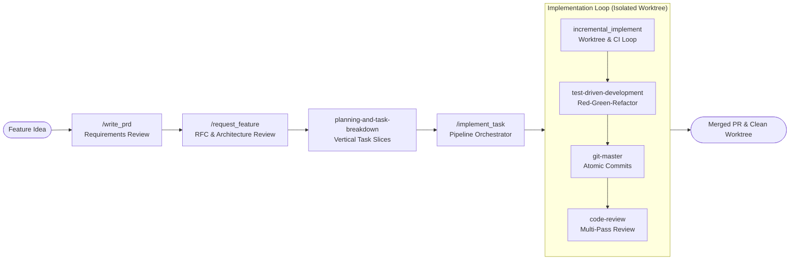
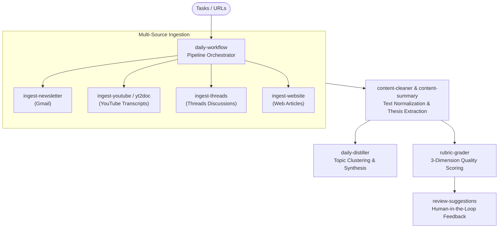

# Agent Skills Repository

A centralized library of production-ready AI agent skills designed to automate software engineering, streamline decision-making, enforce quality gates, and orchestrate personal intelligence workflows.

---

## Overview

AI agents are most effective when given specialized, domain-focused procedures rather than ambiguous generic instructions. Each skill in this repository encapsulates a discrete operational capability—combining YAML metadata, structured directives, automated validation gates, and on-demand reference materials.

### Skill Anatomy

Each skill is self-contained within its own directory under `skills/<category>/<skill-name>/`:

```
skills/<category>/<skill-name>/
├── SKILL.md             # Primary instruction spine (YAML frontmatter + directives)
├── README.md            # Optional human-readable documentation
├── references/          # On-demand domain guides, rubrics, and templates
└── scripts/             # Deterministic helper scripts & validation tools
```

---

## Repository Structure

The repository is organized into four active functional domains, plus an archive directory for retired assets:

- [**`development/`**](skills/development): Full software development lifecycle—from feature ideation, PRD drafting, and RFC design to isolated worktrees, TDD, multi-agent code reviews, and git hygiene.
- [**`engineering/`**](skills/engineering): System-level architecture inspection, execution tracing, and quantitative root cause analysis.
- [**`productivity/`**](skills/productivity): Agent steering governance, architecture decision records, token compression, design sparring, and context engineering.
- [**`personal/`**](skills/personal): End-to-end content intelligence, multi-source media ingestion (newsletters, YouTube, Threads, web), daily distillation, and recommendation grading.
- [**`deprecated/`**](skills/deprecated): Historical archive of superseded or retired skills (e.g., `devcontainer-bridge`, `memory-engine`, `newsletter-summary`, `process-delegate-tasks`). Kept strictly for historical reference.

---

## Core Workflow Pipelines

### 1. Autonomous Software Development Lifecycle

An autonomous pipeline orchestrating end-to-end feature delivery: from a raw idea to an approved PRD, RFC, vertically-sliced tasks, isolated git worktree implementation, Red-Green-Refactor testing, and automated code review.



---

### 2. Content Intelligence & Daily Distillation Pipeline

An automated knowledge pipeline that polls inbox tasks, ingests multi-format media, extracts core theses, clusters daily insights, and routes actionable suggestions through a multi-dimensional rubric to a human-in-the-loop review board.



---

## Skills Catalog

### Development Skills (`skills/development/`)

| Skill | Pattern / Role | Description | Invocation |
|:------|:---------------|:------------|:-----------|
| [`write_prd`](skills/development/write_prd) | Inversion / PM | Turn raw feature ideas into rigorous, approved Product Requirements Documents. | `/write_prd <idea>` |
| [`request_feature`](skills/development/request_feature) | Pipeline | Orchestrate full planning lifecycle: PRD → RFC → Architecture Review → Task List. | `/request_feature <idea>` |
| [`planning-and-task-breakdown`](skills/development/planning-and-task-breakdown) | Generator | Decompose specs into small, ordered, vertically-sliced tasks with automated verification. | `Use @planning-and-task-breakdown` |
| [`implement_task`](skills/development/implement_task) | Pipeline | Drive planned tasks end-to-end with tests, CI, and multi-agent review to a merged PR. | `/implement_task <feature>` |
| [`incremental_implement`](skills/development/incremental_implement) | Worktree / Git | Safe PR lifecycle inside an isolated worktree with atomic commits and unbounded CI loop. | `/incremental_implement <task>` |
| [`test-driven-development`](skills/development/test-driven-development) | Enforcer | Enforce Red → Green → Refactor for changes and Prove-It bug reproduction tests. | `Use @test-driven-development` |
| [`code-review`](skills/development/code-review) | Auditor | Multi-dimensional code review across style rubrics, spec compliance, and security checklists. | `/review-work` or `Use @code-review` |
| [`git-master`](skills/development/git-master) | Tool Specialist | Atomic commits with style detection, interactive rebase/squash, and git archaeology. | `Use @git-master` |
| [`investigate_issue`](skills/development/investigate_issue) | Diagnostic | Full issue resolution lifecycle: triage, root cause diagnosis, RCA review, and fix. | `Use @investigate_issue` |

---

### Engineering Skills (`skills/engineering/`)

| Skill | Pattern / Role | Description | Invocation |
|:------|:---------------|:------------|:-----------|
| [`evolution-log`](skills/engineering/evolution-log) | Chronicler | Generate, update, or audit narrative development histories across iterative decision cycles. | `update my evolution log` |
| [`flow-tracer`](skills/engineering/flow-tracer) | Static Analysis | Trace complete code execution paths across the codebase and output sequence diagrams. | `trace the flow of <target>` |
| [`rca`](skills/engineering/rca) | Diagnostic | Structured Root Cause Analysis enforcing quantitative hypotheses and verification tests. | `run rca on <issue>` |

---

### Productivity Skills (`skills/productivity/`)

| Skill | Pattern / Role | Description | Invocation |
|:------|:---------------|:------------|:-----------|
| [`agent-rules-reviewer`](skills/productivity/agent-rules-reviewer) | Governance | Audit and refactor `AGENTS.md` and `CLAUDE.md` using 3-tier rules architecture. | `review AGENTS.md` |
| [`architecture-decision-records`](skills/productivity/architecture-decision-records) | Documentation | Write and maintain Architecture Decision Records (ADRs) following industry standards. | `create ADR for <decision>` |
| [`caveman`](skills/productivity/caveman) | Token Compressor | Ultra-compressed communication mode cutting token usage ~75% while keeping accuracy. | `/caveman` |
| [`documentation`](skills/productivity/documentation) | Technical Writer | End-to-end documentation workflow covering APIs, architecture, READMEs, and wikis. | `/documentation` |
| [`grill-me`](skills/productivity/grill-me) | Sparring Partner | Relentlessly interview the user about a plan or design until reaching shared understanding. | `/grill-me` |
| [`insight`](skills/productivity/insight) | Retrospective | Analyze agent conversation history to identify bottlenecks and suggest workflow updates. | `/insight` |
| [`skill-context-refactor`](skills/productivity/skill-context-refactor) | Refactorer | Optimize skills via Context Engineering (Lean Spine <200 lines + Progressive Disclosure). | `refactor skill <name>` |
| [`tech-deconstructor`](skills/productivity/tech-deconstructor) | Analyst | Deconstruct papers, RFCs, and architectures into a structured 4-part analytical breakdown. | `deconstruct this paper` |

---

### Personal & Content Intelligence Skills (`skills/personal/`)

| Skill | Pattern / Role | Description | Invocation |
|:------|:---------------|:------------|:-----------|
| [`daily-workflow`](skills/personal/daily-workflow) | Orchestrator | Chain content ingestion, text cleaning, thesis extraction, distillation, and scoring. | `run daily workflow` |
| [`daily-distiller`](skills/personal/daily-distiller) | Synthesizer | Synthesize daily ingestion reports into topic clusters and actionable knowledge briefs. | `distill today's reports` |
| [`decision-sparring`](skills/personal/decision-sparring) | Sparring Partner | Stress-test decisions and break analysis paralysis using 9 structured mental models. | `spar with me on <decision>` |
| [`ingest-newsletter`](skills/personal/ingest-newsletter) | Ingestion | Ingest unread newsletters from Gmail (`label:newsletter is:unread`) into markdown digests. | `ingest newsletters` |
| [`ingest-youtube`](skills/personal/ingest-youtube) | Ingestion | Transcribe and summarize YouTube videos into structured markdown reports. | `transcribe this YouTube video` |
| [`ingest-threads`](skills/personal/ingest-threads) | Ingestion | Fetch Threads posts and discussion threads, producing structured intelligence reports. | `ingest threads post <url>` |
| [`ingest-website`](skills/personal/ingest-website) | Ingestion | Fetch generic websites via Jina Reader API and produce structured summaries. | `ingest this article <url>` |
| [`web-to-markdown`](skills/personal/web-to-markdown) | Converter | Convert any webpage URL into clean Markdown using the Jina Reader API. | `convert this page to markdown` |
| [`yt2doc`](skills/personal/yt2doc) | CLI Wrapper | Transcribe and organize YouTube videos into documentation using the local yt2doc CLI. | `turn this video into a document` |
| [`fetch-threads-post`](skills/personal/fetch-threads-post) | Scraper | Headless browser extraction of Threads post content, authors, and replies. | `fetch threads post <url>` |
| [`content-cleaner`](skills/personal/content-cleaner) | Normalizer | Extract pure article text from raw text files, HTML dumps, or URLs. | `clean article text from <source>` |
| [`content-summary`](skills/personal/content-summary) | Shared Pipeline | Shared thesis-driven summarization and analytical framework for ingested content. | `summarize content with thesis` |
| [`rubric-grader`](skills/personal/rubric-grader) | Evaluator | Score AI suggestions across a 3-dimension rubric and route to backlogs. | `grade suggestions` |
| [`review-suggestions`](skills/personal/review-suggestions) | Review Board | Present unreviewed suggestions as an artifact to collect user Accept/Reject feedback. | `review my suggestions` |
| [`review-newsletter-subscriptions`](skills/personal/review-newsletter-subscriptions) | Auditor | Audit newsletter subscriptions by conversion rate and propose keep/unsubscribe actions. | `review my newsletter subscriptions` |
| [`study-github-repo`](skills/personal/study-github-repo) | Research | Comprehensive architectural and code quality study of any GitHub repository. | `study this repo <github-url>` |
| [`agent-browser`](skills/personal/agent-browser) | CLI Tool | Browser automation CLI for AI agents to interact with dynamic web applications. | `browse <url>` |

---

## How to Use in Agent Environments

### Google Antigravity

Antigravity discovers skills from both global configuration and workspace directories:

1. **User Global Installation**: Symlink or copy desired skills to `~/.gemini/antigravity/skills/` (or `~/.gemini/config/skills/`):
   ```bash
   ln -s "$(pwd)/skills/development/write_prd" ~/.gemini/antigravity/skills/write_prd
   ```
2. **Workspace-Level Skills**: Keep this repository open as an active workspace or link skills into your project's `.agent/skills/` directory.
3. **Triggering**: Invoke registered slash commands (e.g., `/write_prd`, `/implement_task`, `/caveman`) or mention `@skill-name` directly in conversation.

### Claude Code

Claude Code reads steering instructions from `CLAUDE.md` and `AGENTS.md`:

1. Keep the root [`CLAUDE.md`](CLAUDE.md) pointer directing the agent to [`AGENTS.md`](AGENTS.md).
2. Reference skills directly by path (e.g. `skills/development/write_prd/SKILL.md`) in prompts or slash command aliases.

### General Agent Platforms (Cursor, Codex, OpenHands)

All skills strictly conform to the Agent Skill standard:
- Place skill folders into your project root or `.agent/skills/`.
- The entrypoint `SKILL.md` contains self-describing YAML frontmatter (`name`, `description`) enabling automated tool discovery and prompt injection.

---

## Contributing & Adding Skills

When contributing new skills or optimizing existing ones:
1. **Context Engineering**: Follow [`skill-context-refactor`](skills/productivity/skill-context-refactor) principles—keep `SKILL.md` instruction spines lean (<200 lines) and place large guidelines or schemas into `references/`.
2. **Deterministic Scripts**: For tasks requiring accurate calculations, statistics, or multi-file parsing, use dedicated Python scripts in `scripts/` rather than relying on LLM mental arithmetic.
3. **No Unnecessary Tests**: Pure markdown documentation and skill guides are exempt from code-level test suites. Focus automated testing on executable scripts and tool code.
