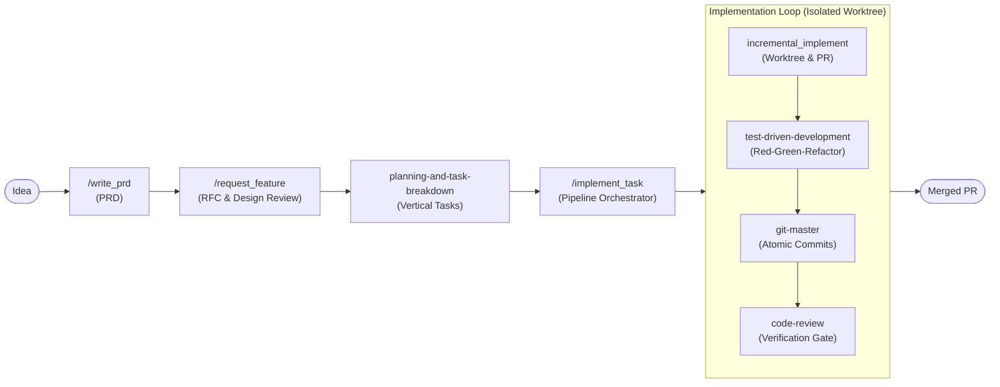
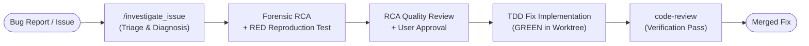

# Development Skills

A collection of AI agent skills that cover the full software development lifecycle — from feature ideation to merged PR. These skills can be used independently or chained together as an automated pipeline.

---

## Overview

### Feature Delivery Pipeline



### Bug Triage & Remediation Pipeline



| Skill | Pattern | One-liner |
|:------|:--------|:----------|
| [write_prd](#write_prd) | Inversion / PM | Turn a raw idea into an approved PRD |
| [request_feature](#request_feature) | Pipeline | Orchestrate PRD → RFC → Plan in one command |
| [planning-and-task-breakdown](#planning-and-task-breakdown) | Generator | Decompose a spec into ordered, verifiable tasks |
| [implement_task](#implement_task) | Pipeline | Execute a planned task end-to-end with full review board |
| [incremental_implement](#incremental_implement) | Worktree / Git | Safe PR lifecycle via isolated worktree |
| [test-driven-development](#test-driven-development) | Enforcer | Enforce Red → Green → Refactor for every change |
| [code-review](#code-review) | Auditor | Multi-dimensional code review (style rubrics, specs, security) |
| [git-master](#git-master) | Tool Specialist | Atomic commits, rebase/squash, and history archaeology |
| [investigate_issue](#investigate_issue) | Pipeline | End-to-end bug triage, root-cause RCA, and TDD-driven remediation |

---

## Skills

### `write_prd`

**Purpose:** Turn a raw feature idea into a rigorous, approved Product Requirements Document (PRD).

**When to use:**
- You have a new feature idea and want structured requirements before writing any code.
- You need to document functional and non-functional requirements for stakeholder alignment.

**When NOT to use:**
- The feature already has an approved PRD or clear requirements.
- The task is pure code generation, debugging, or Q&A.

**How to invoke:**
```
/write_prd <your idea>
```

**What it does:**
1. Analyzes your idea and asks clarifying questions if ambiguous.
2. Drafts a PRD with Context, Problem Statement, and Requirements sections.
3. Saves to `docs/prds/prd_<feature_name>.md`.
4. **Pauses** and asks for your approval before concluding.
5. Iterates on your feedback until you say "Approved".

---

### `request_feature`

**Purpose:** Orchestrate the full planning pipeline — from a single idea through PRD, RFC, architecture review, and task breakdown — using a multi-agent review board.

**When to use:**
- You have a new idea and want a complete, reviewed technical plan ready for implementation.
- You need an RFC with design alternatives, scored against engineering criteria.

**When NOT to use:**
- You already have an approved RFC and task list. Use `implement_task` instead.
- The change is too small to warrant a formal design process (simple config changes, minor bug fixes).

**How to invoke:**
```
/request_feature <idea>
```

**What it does:**
1. **Requirements Phase** — Runs `write_prd`. Pauses for your PRD approval.
2. **Technical Design Phase** — Generates an RFC with a simpler baseline alternative and a decision scorecard.
3. **Design Review Phase** — Red-teams the RFC with an architect agent, runs an implementation feasibility review with an engineer agent, revises until internally approved. Pauses for your RFC approval.
4. **Planning Phase** — Produces `docs/plans/plan_<feature>.md` and `docs/plans/tasks_<feature>.md` with checkboxes.

> **Tip:** This skill is planning-only. No application code is modified. Implementation is handled by `implement_task`.

---

### `planning-and-task-breakdown`

**Purpose:** Decompose a specification or large feature into small, ordered, and verifiable tasks using vertical slicing and dependency mapping.

**When to use:**
- A task feels too large or vague to start immediately.
- You need to estimate scope or parallelize work across multiple agents or sessions.
- The implementation order of components is not obvious.

**When NOT to use:**
- Single-file changes with a clear, constrained scope.
- The spec already has well-defined, granular tasks with acceptance criteria.

**How to invoke:**
```
Use @planning-and-task-breakdown to break down <spec or feature>
```

**What it does:**
1. Reads the spec in read-only mode. Does not write any code.
2. Maps the dependency graph bottom-up (e.g., Schema → API → UI).
3. Slices tasks vertically (each task is a complete feature path, not a horizontal layer).
4. Writes tasks with: paragraph description, testable acceptance criteria, automated verification steps, upstream dependencies, and size estimate (XS–L).
5. Decomposes any XL tasks further.
6. Inserts verification checkpoints after every 2–3 tasks.

**Output:** A markdown implementation plan with `## Overview`, `## Architecture Decisions`, `## Task List`, `## Risks`, and `## Open Questions`.

> **Rule:** Every verification step must be fully automated. No manual checks allowed.

---

### `implement_task`

**Purpose:** Execute an already-planned task end-to-end — writing tests, implementing code, running CI, and completing a full code review loop until the PR is approved and merged.

**When to use:**
- You have an approved RFC, plan, and task list from `request_feature`.
- You want to pick the next pending task and drive it all the way to a merged PR automatically.

**When NOT to use:**
- No plan or task list exists yet. Run `request_feature` first.
- You only want to implement without a review process.

**How to invoke:**
```
/implement_task <feature_name>
```

**What it does:**
1. **Pre-Flight** — Reads `docs/plans/tasks_<feature>.md`, identifies pending tasks, detects tightly coupled batches, and asks you: **[Take 1]** or **[Take All]**.
2. **Implementation Phase** — Runs `incremental_implement` + `test-driven-development` inside an isolated worktree. Produces an implementation scorecard.
3. **Code Review Phase** — Two review passes: Test Red-Team (test quality, missing cases) and Code Risk (bugs, security, coupling, scope creep). Internal fix loop, then pauses for **your** approval.
4. **Deployment Phase** — Confirms CI is green, PR is approved, then merges and cleans up the worktree.

**Scorecard dimensions:** Scope control, Correctness, Test evidence, Simplicity, Reliability, Security, Backward compatibility, Observability, CI stability, Maintainability.

---

### `incremental_implement`

**Purpose:** Safe, isolated PR lifecycle — worktree setup, atomic commits, PR creation, and an unbounded CI + review loop until merged.

**When to use:**
- You want to implement a task and create a PR with CI validation and peer review.
- Keywords: "create a PR", "implement and PR", "land this as a PR", "implement end to end".

**When NOT to use:**
- Committing directly to `master` or `dev`.
- Simple edits where no CI or review is needed.

**How to invoke:**
```
/incremental_implement <task summary>
```
Or invoke it as a sub-skill inside `implement_task`.

**What it does:**
1. **Isolated Worktree** — Creates a sibling `feature/*` branch and worktree to avoid polluting your working state.
2. **Implement & Pre-Validate** — Implements exactly ONE task. Commits atomically using `git-master`. Runs local build/test/lint.
3. **PR Creation** — Pushes and creates a PR with a structured body (Summary, Changes, Testing).
4. **Verification Loop** — Watches CI (`gh pr checks --watch`). If CI fails, fixes and retries. When CI passes, runs `review-work`. Loop continues until both gates pass.
5. **Merge & Cleanup** — Squash-merges the PR, deletes the branch, removes the worktree.

> **Note:** If an unrecoverable error occurs, the worktree is preserved for manual inspection.

---

### `test-driven-development`

**Purpose:** Enforce a strict Red → Green → Refactor cycle for every code change. Language and framework agnostic.

**When to use:**
- Implementing any new logic, behavior, or feature.
- Fixing a bug (uses the "Prove-It" pattern: reproduce the bug in a test first).
- Modifying existing functionality where behavior could break.

**When NOT to use:**
- Pure config changes (CI/CD YAML, environment variables).
- Documentation updates.
- Static content with no behavioral impact.

**How to invoke:**
```
Use @test-driven-development to implement <task or bug fix>
```
Or invoke it automatically inside `implement_task` / `incremental_implement`.

**What it does:**
1. **RED** — Writes a failing test focused on state and outcome (DAMP style). Runs the test runner and validates it actually fails.
2. **GREEN** — Writes the minimal production code to make the test pass.
3. **REFACTOR** — Cleans up: extracts shared logic, improves naming, removes duplication. Full suite must still pass.

> **Bug Fix Special Case:** For bugs, you must first write a test that reliably reproduces the bug before writing any fix (Prove-It pattern).

---

### `code-review`

**Purpose:** Multi-dimensional, scalable code review before committing or merging. Evaluates diffs against language-specific style rubrics, RFC/Plan specification compliance, and language-agnostic bug/security checklists while honoring learned team preferences.

**When to use:**
- After substantial implementation work, before creating a commit or PR.
- Manually with `/review-work` or `Use @code-review` when you want a comprehensive quality check.
- Automatically delegated to by `implement_task` during Phase 2 (Code Review).

**When NOT to use:**
- Working tree is clean (nothing to review).
- Read-only exploration tasks.
- Code doesn't compile or has syntax errors.

**How to invoke:**
```
/review-work
```
Or:
```
Use @code-review
```

**What it does:**
1. **Captures diff & context**: Reads git diff, RFC specifications, and plan acceptance criteria.
2. **Dimension 1 (Style Review)**: Evaluates changed code against language rubrics (e.g. `golang.md`), enforcing binary pass/fail rules (`R-<LANG>-xx`) and surfacing contextual guidelines (`C-<LANG>-xx`).
3. **Dimension 2 (Spec Compliance)**: Validates implementation completeness against RFC requirements and Plan acceptance criteria (`✅ Implemented`, `⚠️ Partial`, `❌ Missing`).
4. **Dimension 3 (Bugs, Security & Tests)**: Checks for null dereferences, race conditions, injection vulnerabilities, and test coverage gaps.
5. **Team Preferences**: Prioritizes learned project conventions from `memory/preferences.md` over baseline rules.

**Output format:**

| # | Verdict | Category | File | Issue | Action |
|---|---------|----------|------|-------|--------|
| 1 | Fixed | BUG | file.ts:42 | Null check missing | Fixed |

---

### `git-master`

**Purpose:** Expert git operations — atomic commits with style detection, rebase/squash history cleanup, and history archaeology (blame, bisect, log).

**When to use:**
- Any git operation: committing, rebasing, squashing, or searching history.
- Keywords: "commit", "rebase", "squash", "who wrote", "when was X added", "find the commit that".

**Modes:**

| Request Pattern | Mode |
|----------------|------|
| "commit", changes to commit | `COMMIT` |
| "rebase", "squash", "cleanup history" | `REBASE` |
| "find when", "who changed", "git blame", "bisect" | `HISTORY_SEARCH` |

**How to invoke:**
```
Use @git-master to commit these changes
Use @git-master to squash my last 3 commits
Use @git-master to find when X was introduced
```

**COMMIT mode — key rules:**
- Always makes **multiple commits** from multiple files. Single commit from 3+ files = automatic failure.
- Formula: `min_commits = ceil(file_count / 3)`.
- Detects commit style (SEMANTIC / PLAIN / SHORT) and language (English / Korean) from `git log` before committing.
- Pairs test files with their implementation in the same commit.
- Orders commits by dependency level (utilities → models → services → API → config).

**REBASE mode:**
- Interactive squash, autosquash (`fixup!`/`squash!` commits), rebase onto main, commit reordering, and conflict resolution.
- Never rewrites pushed history without warning.

**HISTORY_SEARCH mode:**
- Uses `git blame`, `git bisect`, and `git log -S` to find when and where a specific change was introduced.

---

### `investigate_issue`

**Purpose:** Orchestrate the complete issue resolution lifecycle — from issue triage and forensic diagnosis to human-approved RCA, TDD-driven fix implementation, multi-pass code review, and merge.

**When to use:**
- You have a bug report, unexpected failure, or GitHub issue (`/investigate_issue #<number>` or `/investigate_issue <description>`).
- You need evidence-backed diagnosis that systematically tests and rejects alternative hypotheses before touching application code.

**When NOT to use:**
- Simple, obvious bugs where the root cause is already known and stated (use `@test-driven-development` with Prove-It pattern directly).
- New feature requests or architectural redesigns (use `/request_feature`).
- Issues originating entirely in external infrastructure outside the codebase.

**How to invoke:**
```
/investigate_issue <issue description or #number>
```

**What it does:**
1. **Issue Triage (Orchestrator)** — Parses input or fetches the issue body via GitHub CLI (`gh issue view`). Generates an issue slug.
2. **Root Cause Investigation (Investigator Sub-Agent)** — Forensically explores the code, reproduces the failure, forms and quantitatively rejects competing hypotheses, and writes a failing **RED** reproduction test without implementing a fix.
3. **RCA Quality Gate (RCA Reviewer Sub-Agent)** — Red-teams the RCA for evidence rigor, hypothesis testing, and blast radius before human presentation.
4. **Human Approval Gate (Inversion)** — Pauses for user approval of the RCA and reproduction test.
5. **Fix Implementation (Engineer Sub-Agent)** — Executes minimal TDD implementation in an isolated worktree via `incremental_implement` (RED → GREEN).
6. **Code Review & Deployment** — Reviews the fix via `code-review` and merges upon passing review.

---

## Recommended Workflows

### New Feature (Full Pipeline)

```
/request_feature <idea>
   └─ write_prd (PRD + approval)
   └─ RFC generation + architecture review
   └─ planning-and-task-breakdown
      └─ tasks_<feature>.md created

/implement_task <feature>
   └─ incremental_implement (worktree)
      └─ test-driven-development (RED → GREEN → REFACTOR)
      └─ git-master (atomic commits)
      └─ code-review (CI + multi-dimensional review)
   └─ Merge + cleanup
```

### Bug Investigation & Remediation (Forensic RCA Pipeline)

```
/investigate_issue <issue>
   └─ Issue triage & slug generation
   └─ Investigator: reproduce + reject hypotheses + write RED test
   └─ RCA Quality Gate (rca-reviewer red-team review)
   └─ Human approval gate (Inversion)
   └─ Engineer: TDD implementation (RED → GREEN) in isolated worktree
   └─ Code review (code-review verification pass)
   └─ Squash-merge & clean worktree
```

### Quick Bug Fix (Root Cause Known)

```
/review-work                           # baseline check
@test-driven-development to fix <bug>  # Prove-It pattern (RED -> GREEN)
@git-master to commit                   # atomic commit
```

### Cleanup Before a PR

```
@git-master to squash my WIP commits   # REBASE mode
/review-work                           # final quality gate
```

---

## File Conventions

Skills that generate planning artifacts write to:

| File | Created by |
|------|-----------|
| `docs/prds/prd_<feature>.md` | `write_prd`, `request_feature` |
| `docs/rfcs/rfc_<feature>.md` | `request_feature` |
| `docs/plans/plan_<feature>.md` | `request_feature`, `planning-and-task-breakdown` |
| `docs/plans/tasks_<feature>.md` | `request_feature` |
| `docs/rcas/rca_<issue>.md` | `investigate_issue` |
