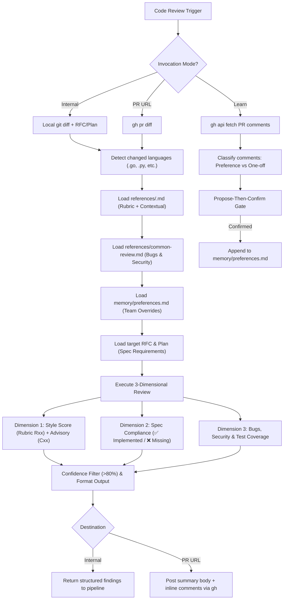

# 🔍 Unified Code Review Skill (`code-review`)

> **Comprehensive Multi-Dimensional Code Review & Preference Learning** — Performs language-specific style enforcement via hybrid rubrics, specification compliance against RFCs/Plans, and language-agnostic bug/security/test verification, with native GitHub CLI integration and human feedback learning.

---

## Table of Contents

- [Overview](#overview)
- [Architecture & Directory Structure](#architecture--directory-structure)
- [The Three Invocation Modes](#the-three-invocation-modes)
  - [Mode 1: Internal Mode (Pipeline Review)](#mode-1-internal-mode-pipeline-review)
  - [Mode 2: PR URL Mode (GitHub Native Review)](#mode-2-pr-url-mode-github-native-review)
  - [Mode 3: Learn Mode (Preference Memory)](#mode-3-learn-mode-preference-memory)
- [The Three Review Dimensions](#the-three-review-dimensions)
  - [Dimension 1: Style Review (Scored)](#dimension-1-style-review-scored)
  - [Dimension 2: Spec Compliance](#dimension-2-spec-compliance)
  - [Dimension 3: Bugs, Security & Tests](#dimension-3-bugs-security--tests)
- [Preference Memory & Precedence Rules](#preference-memory--precedence-rules)
- [Confidence-Based Filtering](#confidence-based-filtering)
- [Review Output Template](#review-output-template)
- [Architecture Decision Records (ADRs)](#architecture-decision-records-adrs)
- [Related Agents & Skills](#related-agents--skills)
- [When NOT to Use](#when-not-to-use)
- [Changelog](#changelog)

---

## Overview

The `code-review` skill consolidates code quality review into a single, composable agent capability. It addresses three major shortcomings of traditional agent-driven code review:

1. **Lack of Coding Style Enforcement**: Reviews against structured, language-specific rubrics (e.g., Uber Go Style Guide).
2. **Missing Spec Compliance**: Automatically maps and verifies implementation changes against requirements defined in RFCs and Implementation Plans.
3. **No Continuous Learning Loop**: Learns team conventions directly from GitHub Pull Request review comments and records them in a per-project memory file (`preferences.md`).



---

## Architecture & Directory Structure

The skill maintains a clean separation between upstream raw sources, executable rubrics, and project-level memory:

```
.agents/skills/code-review/
├── README.md                          # This documentation file
├── SKILL.md                           # Core agent instructions & prompt specification
├── sources/                           # Raw upstream style guides (reference-only, never loaded during review)
│   └── golang.md                      # Full upstream Uber Go Style Guide
├── references/                        # Processed rubrics and checklists loaded at review time
│   ├── golang.md                      # Transformed Go hybrid rubric (Rxx rules) + contextual guidelines (Cxx)
│   └── common-review.md              # Language-agnostic bugs, security, and test checklists
└── memory/                            # Per-project learned conventions
    └── preferences.md                 # Markdown preference store populated via Learn Mode
```

---

## The Three Invocation Modes

### Mode 1: Internal Mode (Pipeline Review)
- **Trigger**: Invoked autonomously by the `implement_task` pipeline or during pair-programming.
- **Input**: Local git diff (`git diff --staged` or `git diff $(git merge-base HEAD main)..HEAD`), target RFC path, and target Plan path.
- **Output**: Structured Markdown findings returned in-memory directly to the calling agent (`engineer` or orchestrator).

### Mode 2: PR URL Mode (GitHub Native Review)
- **Trigger**: User provides a GitHub Pull Request URL or number (`/code-review https://github.com/org/repo/pull/42`).
- **Input**: `gh pr diff <number> -R <owner/repo>` and optional RFC/Plan paths.
- **Output**: Posts directly to GitHub using a hybrid review model:
  - High-level review summary posted via `gh pr review <number> --comment --body "<summary>"`.
  - Inline code comments posted for **HIGH** and **CRITICAL** findings only via `gh api repos/{owner}/{repo}/pulls/<number>/reviews`.

### Mode 3: Learn Mode (Preference Memory)
- **Trigger**: User prompts `"learn from my comments"`, `"learn from PR #42"`, or invokes `/learn`.
- **Workflow**:
  1. **Fetch**: Runs `gh api repos/{owner}/{repo}/pulls/<number>/comments` to retrieve review comments.
  2. **Filter**: Ignores bot comments and extracts feedback from human team members.
  3. **Classify**: Distinguishes enduring team conventions from situational one-off requests.
  4. **Propose-Then-Confirm Gate**: Presents candidate preferences in standard markdown format for user approval.
  5. **Append**: Confirmed entries are appended to `memory/preferences.md`.

---

## The Three Review Dimensions

### Dimension 1: Style Review (Scored)
Evaluated against `references/<lang>.md` using a **hybrid rubric** model:
- **Rubric Rules (`Rxx`)**: Binary pass/fail rules with explicit checks, bad examples, and good examples (e.g., `R01: Error Wrapping`). Contributes to the numerical Style Score:
  $$\text{Style Score} = \left(\frac{\text{Passed Rubric Rules}}{\text{Total Evaluated Rubric Rules}}\right) \times 100\%$$
- **Contextual Guidelines (`Cxx`)**: Nuanced, judgment-based best practices (e.g., `C01: Pointer vs Value Receivers`). Surfaced as non-scoring advisory notes.

### Dimension 2: Spec Compliance
When an RFC (`docs/rfcs/rfc_<name>.md`) or Plan (`docs/plans/plan_<name>.md`) is provided:
- Extracts discrete functional requirements and acceptance criteria.
- Verifies each requirement against the diff:
  - `✅ Implemented`: Fully implemented and verified.
  - `⚠️ Partial`: Implemented with incomplete edge-case handling.
  - `❌ Missing`: Specified in RFC/Plan but absent in code changes.

### Dimension 3: Bugs, Security & Tests
Language-agnostic checklist defined in `references/common-review.md`:
- **Security (CRITICAL)**: Hardcoded secrets, SQL/Command injection, XSS, path traversal, CSRF, broken authentication.
- **Bugs (HIGH)**: Logic errors, nil/null pointer dereferences, race conditions, unhandled errors, resource leaks.
- **Test Coverage (MEDIUM)**: New execution branches without tests, missing negative test cases.

---

## Preference Memory & Precedence Rules

When a team preference recorded in `memory/preferences.md` conflicts with an upstream style guide rule in `references/<lang>.md`:

1. **Immutable Baseline**: The style guide in `references/<lang>.md` is **never modified on disk**. It remains a pristine upstream standard.
2. **Runtime Precedence**: During review evaluation (in memory), the agent **adopts the team preference over the style guide rule**. The baseline rule is bypassed.
3. **Scoring Alignment**: Code following the team preference counts as compliant and is not penalized.
4. **Audit Transparency**: The review summary explicitly notes active overrides:
   > *Active Override:* Rule `R01` superseded at review time by project preference: `Prefer pkg/errors.Wrap`.
5. **Reversibility**: Deleting an entry from `preferences.md` immediately restores baseline rule enforcement in future reviews without disk cleanup.

---

## Confidence-Based Filtering

To eliminate review fatigue and false positives, the skill enforces strict filters:
- **>80% Confidence Threshold**: Only flag an issue if you are at least 80% confident it represents a true defect or convention violation.
- **Changed Lines Only**: Restrict checks to modified lines and immediate call sites. Do not flag pre-existing issues in untouched code unless they represent CRITICAL security vulnerabilities.
- **No Subjective Nitpicks**: Stylistic findings must cite a specific rubric rule (`Rxx`) or learned preference.
- **Consolidation**: Group repetitive violations into a single consolidated finding listing all occurrences.

---

## Review Output Template

```markdown
## Code Review: PR #42 (feature/user-auth)

### Style: 15/18 rubric rules passed (83%)
| Rule | Severity | Verdict | Location |
|------|----------|---------|----------|
| R01: Error Wrapping | HIGH | ❌ | pkg/auth/jwt.go:42 |
| R02: Import Ordering | LOW | ✅ | — |

*Active Overrides:* Rule R05 superseded by project preference: Prefer errors.Wrap

### Spec Compliance: docs/rfcs/rfc_user_auth.md
| Requirement | Status | Location |
|-------------|--------|----------|
| JWT authentication middleware | ✅ Implemented | pkg/auth/middleware.go:15 |
| Rate limiting (100 req/min) | ❌ Missing | — |

### Bugs & Security
| # | Severity | Category | File | Issue | Suggestion |
|---|----------|----------|------|-------|------------|
| 1 | CRITICAL | SECURITY | config/config.go:12 | Hardcoded secret key | Move credential to environment variable |
| 2 | HIGH | BUG | pkg/auth/jwt.go:88 | Potential nil pointer dereference | Add nil guard before dereferencing claims |

### Advisory Notes (Contextual, No Score Impact)
- C01: `pkg/auth/jwt.go:28` — Consider using value receiver for immutable token verification struct.

### Summary
| Severity | Count | Status |
|----------|:---:|:---:|
| CRITICAL | 1 | block |
| HIGH | 1 | warn |
| MEDIUM | 0 | pass |
| LOW | 0 | pass |

**Verdict**: ⛔ BLOCK — 1 CRITICAL issue must be resolved before merge.
```

---

## Architecture Decision Records (ADRs)

The design and operating model of the `code-review` skill are governed by six Architecture Decision Records:

### ADR-001: Standalone Composable Skill Architecture
- **Status**: Accepted
- **Context**: The review logic could either be hardcoded into the `implement_task` pipeline or extracted into an independent, portable skill.
- **Decision**: Implemented `code-review` as a standalone, composable skill that can be invoked across three independent modes (Internal, PR URL, Learn).
- **Rationale**: Preserves the "Portable Agent Skills" architectural principle. Pipelines compose the skill; the skill owns the review rules.
- **Consequences**: Pipelines (`implement_task`, `incremental_implement`) remain clean orchestrators without embedded review checklists.

### ADR-002: Per-Project Markdown Preferences
- **Status**: Accepted
- **Context**: Learned team preferences could be stored globally vs. per-project, and as JSONL vs. Markdown.
- **Decision**: Stored in a human-readable Markdown file (`memory/preferences.md`) scoped per repository.
- **Rationale**: Markdown is the native language of LLMs, enabling direct edits without helper scripts. Per-project scoping ensures repositories with differing conventions (e.g., Go vs. Python stacks) do not collide.
- **Consequences**: Preferences are checked into git and shared across the team.

### ADR-003: Hybrid Rubric + Contextual Style Guide Format
- **Status**: Accepted
- **Context**: Upstream style guides contain both objective binary rules and subjective guidelines. Pure prose style guides lead to high false-positive rates and hallucinations.
- **Decision**: Transformed raw guides into a hybrid format: binary `Rxx` Rubric Rules (scored) and judgment-based `Cxx` Contextual Guidelines (advisory only).
- **Rationale**: Cleanly decouples quantifiable compliance scoring from subjective architectural suggestions.
- **Consequences**: Requires a one-time propose-then-confirm transformation when adding new languages.

### ADR-004: GitHub CLI Native Integration
- **Status**: Accepted
- **Context**: Interacting with GitHub Pull Requests could rely on external MCP plugins, custom Python wrapper scripts, or direct `gh` CLI commands.
- **Decision**: Standardized on direct `gh` CLI commands (`gh pr diff`, `gh pr review`, and `gh api`).
- **Rationale**: Zero-script architecture. `gh` is already authenticated and ubiquitous in developer workflows.
- **Consequences**: Relies on `gh` being installed and authenticated with repo access.

### ADR-005: Merge `review-work` into `code-review`
- **Status**: Accepted
- **Context**: The existing `review-work` skill contained bug/security checklists and multi-reviewer routing, while `code-reviewer.md` had a 247-line duplicate checklist.
- **Decision**: Merged `review-work` checklists into `references/common-review.md`, simplified `code-reviewer.md`, and completely deleted the legacy `review-work` skill.
- **Rationale**: Eliminates duplicate diff inspections and provides a single source of truth for all code reviews.
- **Consequences**: Net reduction of over 1,200 lines of redundant code and documentation.

### ADR-006: `implement_task` Delegates Review Logic to Skill
- **Status**: Accepted
- **Context**: `implement_task` Phase 2 historically defined three rigid review passes (Test Red-Team, Code Risk, Tradeoff Compliance), duplicating checklist logic.
- **Decision**: Simplified `implement_task` Phase 2 to delegate review logic entirely to the `code-review` skill.
- **Rationale**: Establishes single-responsibility architecture. `implement_task` manages lifecycle and human approval gates; `code-review` manages review criteria.
- **Consequences**: Future updates to review rules or style rubrics only touch `code-review`.

---

## Related Agents & Skills

| Component | Relationship | Role |
|---|---|---|
| [`@code-reviewer`](file:///Users/allanbian/my-agent-team/.agents/agents/code-reviewer.md) | Agent Persona | Dedicated reviewer agent configured with `skills/code-review` |
| [`implement_task`](file:///Users/allanbian/my-agent-team/.agents/skills/implement_task/SKILL.md) | Pipeline Skill | Invokes `code-review` during Phase 2 (Code Review Phase) |
| [`incremental_implement`](file:///Users/allanbian/my-agent-team/.agents/skills/incremental_implement/SKILL.md) | Sub-skill | Invokes `code-review` as Gate B in the PR verification loop |
| [`investigate_issue`](file:///Users/allanbian/my-agent-team/.agents/skills/investigate_issue/README.md) | Pipeline Skill | References `code-review` for verifying bug fix PRs |

---

## When NOT to Use

- **During early prototyping / exploratory scratchpads**: Overhead of formal rubric scoring is unnecessary for draft code.
- **For simple formatting or syntax fixes**: Use native linters or formatters (`gofmt`, `prettier`, `ruff`) instead of agent review.
- **Without changed files**: Requires a git diff, staged commits, or a PR URL to evaluate.

---

## Changelog

### v1.0.0 — 2026-09-12
- **Initial Release:** Unified Code Review Skill covering three review dimensions (style, spec compliance, bugs/security) and continuous preference learning.
  - **Phase 1 (Core Structure):** Created `SKILL.md` defining the three invocation modes (Internal, PR URL, Learn), created `references/common-review.md` for language-agnostic bug, security, and test checklists, and initialized `memory/preferences.md`.
  - **Phase 2 (Uber Go Style Guide):** Fetched raw upstream Uber Go Style Guide into `sources/golang.md` and transformed it into a hybrid rubric (`references/golang.md`) featuring binary `Rxx` rubric rules (scored) and judgment-based `Cxx` contextual guidelines (advisory).
  - **Phase 3 (Integration & Cleanup):**
    - Simplified `@code-reviewer` agent persona from 247 lines to 26 lines, delegating directly to `skills/code-review`.
    - Simplified `implement_task` Phase 2 to delegate review logic and pass RFC, Plan, and Task paths to the reviewer.
    - Deleted deprecated `review-work` skill directory (`.agents/skills/review-work/`).
    - Cleaned up all dangling references across `incremental_implement`, `investigate_issue`, and repository root `README.md`.
    - Synchronized agent personas across Claude Code (`.claude/`) and OpenAI Codex (`.codex/`) platforms.
