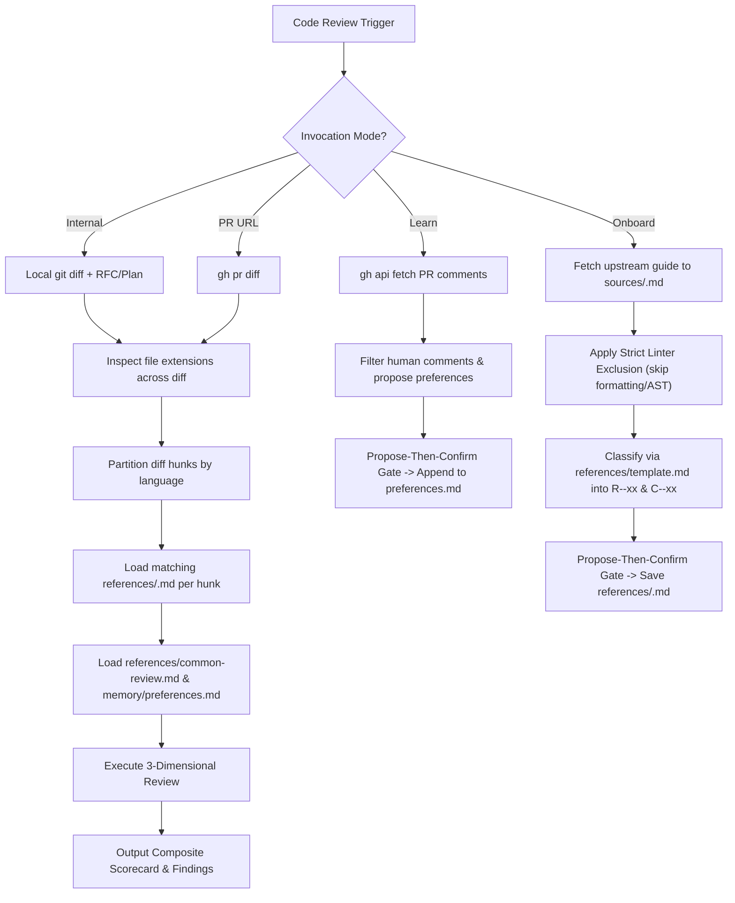

# 🔍 Unified Code Review Skill (`code-review`)

> **Comprehensive Multi-Dimensional Code Review & Preference Learning** — Performs language-specific style enforcement via hybrid rubrics, specification compliance against RFCs/Plans, and language-agnostic bug/security/test verification, with native GitHub CLI integration, polyglot PR routing, and extensible language onboarding.

---

## Table of Contents

- [Overview](#overview)
- [Architecture & Directory Structure](#architecture--directory-structure)
- [The Four Invocation Modes](#the-four-invocation-modes)
  - [Mode 1: Internal Mode (Pipeline Review)](#mode-1-internal-mode-pipeline-review)
  - [Mode 2: PR URL Mode (GitHub Native Review)](#mode-2-pr-url-mode-github-native-review)
  - [Mode 3: Learn Mode (Preference Memory)](#mode-3-learn-mode-preference-memory)
  - [Mode 4: Onboard Mode (Language Expansion)](#mode-4-onboard-mode-language-expansion)
- [The Three Review Dimensions](#the-three-review-dimensions)
  - [Dimension 1: Style Review (Scored)](#dimension-1-style-review-scored)
  - [Dimension 2: Spec Compliance](#dimension-2-spec-compliance)
  - [Dimension 3: Bugs, Security & Tests](#dimension-3-bugs-security--tests)
- [Polyglot PR Partitioning & Routing](#polyglot-pr-partitioning--routing)
- [Expanding to New Languages (How-To Guide)](#expanding-to-new-languages-how-to-guide)
- [Preference Memory & Precedence Rules](#preference-memory--precedence-rules)
- [Confidence-Based Filtering](#confidence-based-filtering)
- [Review Output Template](#review-output-template)
- [Architecture Decision Records (ADRs)](#architecture-decision-records-adrs)
- [Related Agents & Skills](#related-agents--skills)
- [When NOT to Use](#when-not-to-use)
- [Changelog](#changelog)

---

## Overview

The `code-review` skill consolidates code quality review into a single, composable agent capability. It addresses four major shortcomings of traditional agent-driven code review:

1. **Coding Style Enforcement**: Reviews against structured, language-specific rubrics (e.g., Go hybrid rubric).
2. **Missing Spec Compliance**: Automatically maps and verifies implementation changes against requirements defined in RFCs and Implementation Plans.
3. **Continuous Learning Loop**: Learns team conventions directly from GitHub Pull Request review comments and records them in `preferences.md`.
4. **Extensible Architecture**: Can onboard new programming languages on demand using a canonical schema template without bloating the repo.



---

## Architecture & Directory Structure

The skill maintains a clean separation between upstream raw sources, executable rubrics, and project-level memory:

```
.agents/skills/code-review/
├── README.md                          # Comprehensive documentation & expansion guide
├── SKILL.md                           # Core agent instructions & prompt specification
├── sources/                           # Raw upstream style guides (provenance & sync)
│   └── golang.md                      # Full upstream Uber Go Style Guide
├── references/                        # Standardized executable rubrics
│   ├── template.md                    # Canonical schema contract for language rubrics
│   ├── golang.md                      # Go rubric (R-GO-xx binary rules, C-GO-xx guidelines)
│   └── common-review.md              # Language-agnostic bugs, security, and test checklists
└── memory/                            # Per-project learned conventions
    └── preferences.md                 # Markdown preference store populated via Learn Mode
```

---

## The Four Invocation Modes

### Mode 1: Internal Mode (Pipeline Review)
- **Trigger**: Invoked autonomously by the `implement_task` pipeline or during pair-programming.
- **Input**: Local git diff (`git diff --staged` or `git diff $(git merge-base HEAD main)..HEAD`), target RFC path, and target Plan path.
- **Output**: Structured Markdown findings returned in-memory directly to the calling agent.

### Mode 2: PR URL Mode (GitHub Native Review)
- **Trigger**: User provides a GitHub Pull Request URL or number (`gh pr review <pr>`).
- **Input**: `gh pr diff <number> -R <owner/repo>` and optional RFC/Plan paths.
- **Output**: Summary table comment posted via `gh pr review`, with inline comments for **HIGH** and **CRITICAL** findings only via `gh api`.

### Mode 3: Learn Mode (Preference Memory)
- **Trigger**: User prompts `"learn from my comments"` or `"learn from PR #42"`.
- **Workflow**: Fetches PR review comments via `gh api`, filters bot comments, classifies enduring team preferences, presents them at a propose-then-confirm gate, and appends confirmed rules to `memory/preferences.md`.

### Mode 4: Onboard Mode (Language Expansion)
- **Trigger**: User prompts `"Add/transform style guide for <lang> from <source>"`.
- **Workflow**: Fetches raw upstream guide to `sources/<lang>.md`, applies strict linter exclusion, transforms rules into `R-<LANG>-xx` and `C-<LANG>-xx` conforming to `references/template.md`, and writes to `references/<lang>.md` upon user confirmation.

---

## The Three Review Dimensions

### Dimension 1: Style Review (Scored)
Evaluated against `references/<lang>.md` using the **hybrid rubric** model:
- **Rubric Rules (`R-<LANG>-xx`)**: Binary pass/fail checks with explicit criteria and code examples. Contributes to the numerical Style Score:
  $$\text{Style Score} = \left(\frac{\text{Passed Rubric Rules}}{\text{Total Evaluated Rubric Rules}}\right) \times 100\%$$
- **Contextual Guidelines (`C-<LANG>-xx`)**: Nuanced, judgment-based best practices surfaced as non-scoring advisory notes.

### Dimension 2: Spec Compliance
When an RFC (`docs/rfcs/rfc_<name>.md`) or Plan (`docs/plans/plan_<name>.md`) is provided:
- Extracts discrete functional requirements and acceptance criteria.
- Verifies each requirement against the diff (`✅ Implemented`, `⚠️ Partial`, `❌ Missing`).

### Dimension 3: Bugs, Security & Tests
Language-agnostic checklist defined in `references/common-review.md`:
- **Security (CRITICAL)**: Hardcoded secrets, SQL/Command injection, XSS, path traversal, CSRF, broken auth.
- **Bugs (HIGH)**: Logic errors, nil/null pointer dereferences, race conditions, unhandled errors, resource leaks.
- **Test Coverage (MEDIUM)**: New execution branches without tests, missing edge cases.

---

## Polyglot PR Partitioning & Routing

In repositories with multiple languages:
1. **Extension Detection**: The reviewer inspects file extensions in the diff and references the Extension Registry:
   - `.go` $\rightarrow$ `references/golang.md`
   - `.ts`, `.tsx`, `.js`, `.jsx` $\rightarrow$ `references/typescript.md`
   - `.py` $\rightarrow$ `references/python.md`
   - `.rs` $\rightarrow$ `references/rust.md`
   - `.sql` $\rightarrow$ `references/sql.md`
   - `.sh`, `.bash` $\rightarrow$ `references/shell.md`
2. **Hunk Partitioning**: Files are evaluated strictly against their corresponding language rubric. Go rules never evaluate against TypeScript files.
3. **Composite Scoring**: The review output displays a per-language pass breakdown alongside a combined style score.

---

## Expanding to New Languages (How-To Guide)

When onboarding a new language to the review pipeline, follow this 5-step standard operating procedure:

```
[1. Fetch Raw Source] ──> [2. Linter Exclusion] ──> [3. Draft Rubric] ──> [4. Confirm Gate] ──> [5. Commit & Route]
```

1. **Fetch Upstream Source**: Save the official upstream guide (e.g. Google Python Style Guide) to `sources/<lang>.md`. Add header metadata recording the upstream repository URL, commit hash/tag, date, and license.
2. **Apply Strict Linter Exclusion**:
   - **Omit** mechanical rules: indentation, whitespace, bracket style, line length, import sorting.
   - **Omit** standard AST lints: unused imports, unused variables, basic syntax errors.
   - **Retain** semantic idioms: error propagation, concurrency coordination, resource lifecycles, nil/boundary guards, type assertion safety.
3. **Draft Rubric against Schema Template**: Read [`references/template.md`](references/template.md) as the contract. Structure the rubric into:
   - Category Index
   - Binary Rubric Rules: `R-<LANG>-xx` with Severity, Category, Check, Bad snippet, Good snippet.
   - Contextual Guidelines: `C-<LANG>-xx` with Category, Description, Guidance.
4. **Propose-Then-Confirm Gate**: Present the candidate rubric to the user in an artifact or chat response. Wait for explicit approval before writing.
5. **Commit & Route**: Save the approved file as `references/<lang>.md` and ensure file extensions map to it in `SKILL.md`.

---

## Preference Memory & Precedence Rules

When a team preference recorded in `memory/preferences.md` conflicts with an upstream style guide rule:
1. **Immutable Baseline**: `references/<lang>.md` is never modified on disk.
2. **Runtime Precedence**: During review evaluation, the agent adopts the team preference over the baseline rule.
3. **Scoring Alignment**: Code following the team preference counts as compliant.
4. **Audit Transparency**: The review summary explicitly notes active overrides:
   > *Active Override:* Rule `R-GO-01` superseded at review time by project preference: `Prefer pkg/errors.Wrap`.
5. **Reversibility**: Deleting an entry from `preferences.md` immediately restores baseline rule enforcement.

---

## Confidence-Based Filtering

To eliminate review fatigue and false positives, the skill enforces strict filters:
- **>80% Confidence Threshold**: Only flag an issue if you are at least 80% confident it represents a true defect or convention violation.
- **Changed Lines Only**: Restrict checks to modified lines and immediate call sites. Do not flag pre-existing issues in untouched code unless they represent CRITICAL security vulnerabilities.
- **No Subjective Nitpicks**: Stylistic findings must cite a specific rubric rule (`R-<LANG>-xx`) or learned preference.
- **Consolidation**: Group repetitive violations into a single consolidated finding listing all occurrences.

---

## Review Output Template

```markdown
## Code Review: PR #42 (feature/user-auth)

### Style: 14/16 rubric rules passed (88%)
- Go: 9/10 passed (90%)
- TypeScript: 5/6 passed (83%)

| Rule | Language | Severity | Verdict | Location |
|------|----------|----------|---------|----------|
| R-GO-01: Error Wrapping | Go | HIGH | ❌ | pkg/auth/jwt.go:42 |
| R-GO-09: Avoid Mutable Globals | Go | HIGH | ✅ | — |
| R-TS-01: No Unsafe Type Assertions | TypeScript | HIGH | ❌ | web/app.tsx:18 |

*Active Overrides:* Rule R-GO-04 superseded by project preference: Prefer errors.Wrap

### Spec Compliance: docs/rfcs/rfc_user_auth.md
| Requirement | Status | Location |
|-------------|--------|----------|
| JWT authentication middleware | ✅ Implemented | pkg/auth/middleware.go:15 |
| Rate limiting (100 req/min) | ❌ Missing | — |

### Bugs & Security
| # | Severity | Category | File | Issue | Suggestion |
|---|----------|----------|------|-------|------------|
| 1 | CRITICAL | SECURITY | config/config.go:12 | Hardcoded secret key | Move credential to environment variable |
| 2 | HIGH | BUG | pkg/auth/jwt.go:88 | Potential nil pointer dereference | Add nil guard before dereferencing claims |

### Advisory Notes (Contextual, No Score Impact)
- C-GO-01: `pkg/auth/jwt.go:28` — Consider using value receiver for immutable token verification struct.

### Summary
| Severity | Count | Status |
|----------|:---:|:---:|
| CRITICAL | 1 | block |
| HIGH | 2 | warn |
| MEDIUM | 0 | pass |
| LOW | 0 | pass |

**Verdict**: ⛔ BLOCK — 1 CRITICAL issue must be resolved before merge.
```

---

## Architecture Decision Records (ADRs)

The design and operating model of the `code-review` skill are governed by formal Architecture Decision Records:

### Foundational RFC: [RFC: Unified Code Review Skill](../../../docs/rfcs/rfc_code_review.md)
- **ADR-001**: Standalone Composable Skill Architecture
- **ADR-002**: Per-Project Markdown Preferences (`memory/preferences.md`)
- **ADR-003**: Hybrid Rubric + Contextual Style Guide Format
- **ADR-004**: GitHub CLI Native Integration (`gh pr diff`, `gh pr review`, `gh api`)
- **ADR-005**: Merge `review-work` into `code-review`
- **ADR-006**: `implement_task` Delegates Review Logic to Skill

### Expansion RFC: [RFC: Extensible Style Guide Reference Architecture](../../../docs/rfcs/rfc_style_guide_expansion.md)
- **ADR-001**: Explicit Cognitive Onboarding Workflow for Style Guides (Mode 4)
- **ADR-002**: Dedicated Canonical Schema Template ([`references/template.md`](references/template.md))
- **ADR-003**: Globally Namespaced Rule Identifiers (`R-<LANG>-xx` and `C-<LANG>-xx`)
- **ADR-004**: Strict Linter Exclusion Principle (zero LLM token waste on formatting)
- **ADR-005**: Partitioned Hunk Routing & Unified Scorecard for Polyglot PRs

---

## Related Agents & Skills

| Component | Relationship | Role |
|---|---|---|
| [`@code-reviewer`](file:///Users/allanbian/my-agent-team/.agents/agents/code-reviewer.md) | Agent Persona | Dedicated reviewer agent configured with `skills/code-review` |
| [`implement_task`](file:///Users/allanbian/my-agent-team/.agents/skills/implement_task/SKILL.md) | Pipeline Skill | Invokes `code-review` during Phase 2 (Code Review Phase) |
| [`incremental_implement`](file:///Users/allanbian/my-agent-team/.agents/skills/incremental_implement/SKILL.md) | Sub-skill | Invokes `code-review` as Gate B in the PR verification loop |
| [`investigate_issue`](file:///Users/allanbian/my-agent-team/.agents/skills/investigate_issue/README.md) | Pipeline Skill | References `code-review` for verifying bug fix PRs |

---

## When NOT to Use

- **During early prototyping / exploratory scratchpads**: Overhead of formal rubric scoring is unnecessary for draft code.
- **For simple formatting or syntax fixes**: Use native linters or formatters (`gofmt`, `prettier`, `ruff`) instead of agent review.
- **Without changed files**: Requires a git diff, staged commits, or a PR URL to evaluate.

---

## Changelog

### v1.1.0 — 2026-09-12
- **Extensible Style Guide Architecture & Polyglot Support**:
  - **Canonical Template**: Created `references/template.md` defining schema contract and linter exclusion criteria.
  - **Rule Namespacing**: Migrated Go rules to `R-GO-01`–`R-GO-27` and `C-GO-01`–`C-GO-12` for collision-free polyglot identification.
  - **Mode 4 (Onboard Mode)**: Added 5-step cognitive onboarding procedure in `SKILL.md` with propose-then-confirm gate.
  - **Polyglot Routing**: Added extension registry table and partitioned hunk evaluation in `SKILL.md`.
  - **Documentation**: Added expansion how-to guide in `README.md` and authored [RFC: Extensible Style Guide Reference Architecture](../../../docs/rfcs/rfc_style_guide_expansion.md).

### v1.0.0 — 2026-09-12
- **Initial Release:** Unified Code Review Skill covering three review dimensions (style, spec compliance, bugs/security) and continuous preference learning.
