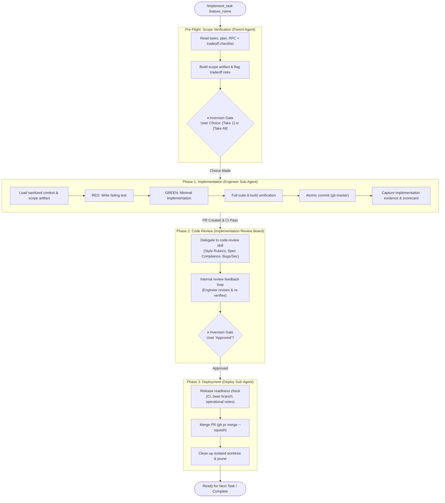

# implement_task

> Autonomous AI Developer Pipeline — picks the approved pending task scope, implements it with full TDD discipline, creates a PR, runs an implementation review board loop, and waits for your final approval.

---

## Table of Contents

- [Overview](#overview)
- [Trigger](#trigger)
- [Pipeline Overview](#pipeline-overview)
- [Phase-by-Phase Reference](#phase-by-phase-reference)
  - [Pre-Flight — Scope Verification](#pre-flight--scope-verification)
  - [Phase 1 — Implementation](#phase-1--implementation)
  - [Phase 2 — Code Review](#phase-2--code-review)
  - [Phase 3 — Deployment](#phase-3--deployment)
- [Output File Structure](#output-file-structure)
- [Human Checkpoints ("Inversions")](#human-checkpoints-inversions)
- [Dependencies](#dependencies)
- [File Structure](#file-structure)
- [Tips & Notes](#tips--notes)
- [Architecture Decisions (ADRs)](#architecture-decisions-adrs)
- [Changelog](#changelog)

---

## Overview

`implement_task` is an agent skill that orchestrates the **execution arm** of the autonomous AI agent pipeline. It picks the approved pending task scope, implements it with strict Test-Driven Development (TDD) discipline in an isolated git worktree, creates a Pull Request, runs an implementation review board loop, and merges upon release readiness verification and human approval.

The pipeline is designed around **human-in-the-loop checkpoints** ("Inversions") and an internal implementation review board model. Scope is selected deliberately, implementation evidence is captured in structured artifacts, reviewers validate code against multi-dimensional standards (language style rubrics, spec compliance against RFC/Plan, bug/security/test verification, and team preferences), and deployment only happens after release readiness is confirmed and approved.

This skill is implementation-only. It requires upstream planning artifacts (`tasks_<feature_name>.md`, `plan_<feature_name>.md`, and `rfc_<feature_name>.md`) produced by `/request_feature`. It delegates work across specialized sub-agents (`engineer` → `code-reviewer` → `deploy`) and enforces strict role separation so that the implementing engineer cannot self-merge without review and approval.

---

## Trigger

Invoke the skill by typing:

```
/implement_task <feature_name>
```

**`<feature_name>`** must exactly match the suffix used in your plan, task, and RFC filenames (e.g., `docs/plans/tasks_<feature_name>.md`).

**Examples:**
```
/implement_task user_authentication
/implement_task payment_gateway
/implement_task dark_mode_toggle
```

The agent will automatically locate the relevant plan and task list files, pick the next unchecked task (or propose an approved batch), and begin execution. You can also ask the agent to "implement the next task" or "start the developer pipeline for `<feature_name>`" — the skill description is written to trigger on that intent too.

---

## Pipeline Overview



---

## Phase-by-Phase Reference

### Pre-Flight — Scope Verification

| Item | Detail |
|------|--------|
| **Sub-agent** | Parent agent (Scope & Decision Orchestrator) |
| **Sub-skill used** | None (orchestration logic) |
| **Input** | `docs/plans/tasks_<feature_name>.md`, `docs/plans/plan_<feature_name>.md`, `docs/rfcs/rfc_<feature_name>.md` |
| **Output** | Structured scope artifact & batch suggestion |
| **Human checkpoint** | ✅ Yes — pauses for scope selection (`[Take 1]` or `[Take All]`) |

The parent agent opens `docs/plans/tasks_<feature_name>.md` and identifies all pending tasks (marked with `[ ]`). It reads the detailed plan and RFC, including the Architecture Tradeoff Checklist appendix.

It builds a structured scope artifact containing:
- Pending task candidates
- Recommended execution scope
- Known dependencies and blockers
- Simpler or smaller viable execution option when one exists
- Expected verification commands from the plan
- Tradeoff risks: cross-references the RFC's Architecture Tradeoff Checklist appendix against the task scope; any task touching a dimension with unresolved or high-risk tradeoffs is flagged as an implementation risk
- Initial implementation risks

If the tasks have strong logical coupling or sequential blocking dependencies (e.g., CI setup depending on test suites), the agent **MUST halt execution**, present the scope artifact, and suggest batching all related tasks in one pass. It asks you to choose between:
- **`[Take 1]`**: Execute only the first pending task
- **`[Take All]`**: Execute the suggested coupled batch

Execution proceeds to Phase 1 only after receiving your explicit decision.

---

### Phase 1 — Implementation

| Item | Detail |
|------|--------|
| **Sub-agent** | `engineer` |
| **Sub-skill used** | `incremental_implement` + `test-driven-development` + `git-master` |
| **Input** | Approved scope artifact + full RFC & Plan for design context |
| **Output files** | Feature branch in isolated worktree, atomic commits, Pull Request, updated `docs/plans/tasks_<feature_name>.md` |
| **Human checkpoint** | ❌ No — automatically creates PR and transitions to Code Review upon passing CI |

The agent invokes the **engineer** sub-agent with **Sanitized Context Guardrails**: the sub-agent receives the full RFC and Plan for technical context, but prompt instructions strictly restrict edits to **ONLY the chosen task(s)** (either the single task or the approved batch).

The engineer executes implementation inside an isolated git worktree via `incremental_implement` (stopping before Step 5: Merge & Cleanup) and `test-driven-development`:

1. **Load context** — reads relevant existing code, type definitions, and established conventions.
2. **RED** — writes a failing test expressing expected behavior. The test must fail before any implementation code is written.
3. **GREEN** — writes the minimal production code required to make the test pass. No over-engineering or unrequested flexibility.
4. **Full test suite** — runs all project tests to catch regressions.
5. **Build verification** — confirms compilation and build pass without errors.
6. **Atomic commit** — commits changes using `git-master` with descriptive, convention-compliant commit messages.
7. **Repeat** — executes steps 2–6 for all approved tasks in the batch.

After each approved task or cohesive batch, the agent captures a structured implementation artifact:
- Approved scope executed
- Files changed
- RED test evidence and command output summary
- GREEN verification evidence and command output summary
- Full-suite / build verification evidence
- Implementation scorecard ratings
- Risks introduced, retired, and any unresolved risks

**Failure Behavior:** If any task in a batch fails, the agent halts immediately, keeps the worktree intact for debugging, and presents the failure details to the user (treating the batch as a single cohesive transaction).

Once all approved tasks pass verification locally, the engineer pushes the branch, creates the Pull Request, and waits for CI checks to pass. Once CI passes and the PR is ready for review, the agent updates `docs/plans/tasks_<feature_name>.md` to mark all completed tasks in the batch as complete (`[x]`).

---

### Phase 2 — Code Review

| Item | Detail |
|------|--------|
| **Sub-agent** | `code-reviewer` + `engineer` (reviser) |
| **Sub-skill used** | `code-review` |
| **Input** | PR diff, `docs/rfcs/rfc_<feature_name>.md`, `docs/plans/plan_<feature_name>.md`, `docs/plans/tasks_<feature_name>.md`, implementation artifact |
| **Output** | Review report & updated Implementation Scorecard |
| **Human checkpoint** | ✅ Yes — loops internally (max 3 rounds) then halts until user types `"Approved"` |

The agent invokes the **code-reviewer** sub-agent configured with the `code-review` skill. Review inputs are passed explicitly:
- PR diff (or staged/local git diff)
- Technical design path (`docs/rfcs/rfc_<feature_name>.md`)
- Detailed plan path (`docs/plans/plan_<feature_name>.md`)
- Task checklist path (`docs/plans/tasks_<feature_name>.md`)
- Implementation artifact and CI results

The reviewer executes multi-dimensional evaluation via the `code-review` skill:
- **Dimension 1 (Style Review):** Evaluates changed files against language-specific rubrics (e.g., `references/golang.md`), enforcing binary pass/fail rules (`R-<LANG>-xx`) and surfacing contextual guidelines (`C-<LANG>-xx`).
- **Dimension 2 (Spec Compliance):** Extracts discrete requirements and acceptance criteria from the RFC and Plan to verify full implementation (`✅ Implemented`, `⚠️ Partial`, `❌ Missing`), ensuring tradeoff decisions from the RFC are respected.
- **Dimension 3 (Bugs, Security & Tests):** Verifies code against `references/common-review.md` for critical security vulnerabilities, high-severity bugs (null pointer dereferences, race conditions, resource leaks), and test coverage completeness.
- **Team Preferences:** Enforces learned project conventions from `memory/preferences.md`, prioritizing them over baseline style rules.

#### Implementation Review Board Roles

| Role | Owner | Purpose |
|---|---|---|
| Scope Orchestrator | Parent agent | Reads RFC, plan, and task list; selects only user-approved scope; prevents task drift |
| Implementer | `engineer` | Executes approved scope with TDD and `incremental_implement` |
| Reviewer | `code-reviewer` | Executes `code-review` across style, spec compliance, bugs/security/tests, and preferences |
| Release Readiness Reviewer | `deploy` | Confirms CI, approval, base branch, checklist state, operational notes, and cleanup plan before merge |
| Decision Orchestrator | Parent agent | Enforces review rounds and halts on unresolved high-severity risks |

#### Implementation Scorecard

The PR is scored from 1 to 10 on:

- Scope control
- Correctness
- Test evidence
- Simplicity
- Reliability
- Security
- Backward compatibility
- Observability or debuggability
- CI stability
- Maintainability

The scorecard does not replace tests, CI, or review. Any high-severity issue in correctness, security, data safety, or scope control blocks progress until fixed or explicitly escalated to the user.

**Internal Feedback Loop:** If issues are found, the `code-reviewer` provides structured feedback back to the `engineer` sub-agent, which revises and re-verifies the PR. This loop repeats until the `code-reviewer` approves internally. The loop is capped at three rounds unless a blocking risk remains unresolved.

**Inversion Gate:** Once internally approved, the agent halts and presents the PR and scorecard to you for review.
- If you provide feedback → `engineer` revises → `code-reviewer` re-reviews → loop repeats.
- Once you input **`"Approved"`** → the pipeline proceeds to Deployment.

---

### Phase 3 — Deployment

| Item | Detail |
|------|--------|
| **Sub-agent** | `deploy` |
| **Sub-skill used** | None (`gh` CLI + git worktree cleanup) |
| **Input** | Approved Pull Request |
| **Output** | Merged PR on base branch, pruned worktree |
| **Human checkpoint** | ❌ No — executes automatically after Phase 2 user approval |

The agent invokes the **deploy** sub-agent to verify release readiness, merge, and clean up:

1. **Release readiness check** — confirms explicit user approval, latest CI pass, intended base branch, checklist state, migration/rollback or operational notes when relevant, and no unresolved high-severity findings.
2. **Merge the PR** — merges the approved Pull Request using `gh pr merge --squash --delete-branch`.
3. **Clean up isolated worktree** — returns to the original directory, removes the isolated worktree (`git worktree remove`), and prunes the worktree directory (`git worktree prune`).

---

## Output File Structure

During and after execution, the pipeline interacts with and produces these artifacts:

```
docs/
└── plans/
    ├── plan_<feature_name>.md        ← Detailed plan with acceptance criteria (read-only reference)
    └── tasks_<feature_name>.md       ← Task checklist (updated: [ ] → [x] as tasks complete)
docs/
└── rfcs/
    └── rfc_<feature_name>.md         ← Technical design & tradeoff checklist (read-only reference)
```

**Git & Pull Request Artifacts:**
- **Feature Branch & Worktree:** Created under `.worktrees/<feature_name>-task-<id>` to isolate working files.
- **Atomic Commits:** Created via `git-master` following conventional commit style.
- **Pull Request:** Created via `gh pr create` with full implementation evidence, scorecard, and test verification summary.
- **Squash Merge:** Merged to the target base branch with the feature branch deleted upon Phase 3 completion.

**Task Checklist Format:**
```markdown
- [ ] Task 1: Implement login endpoint
- [ ] Task 2: Add JWT token validation
- [x] Task 0: Set up project scaffold   ← marked complete upon CI pass
```

The agent marks tasks complete by changing `[ ]` to `[x]`.

---

## Human Checkpoints ("Inversions")

Two explicit approval gates exist in the pipeline:

| Gate | Stage | Trigger condition | How to advance |
|------|-------|-------------------|----------------|
| 1 | Pre-Flight (Scope Verification) | Coupling detected or batch suggested | Select `[Take 1]` or `[Take All]` |
| 2 | Code Review (Phase 2) | Agent halts after internal Reviewer ↔ Engineer loop | Type `Approved` |

If you provide **any other response** at Gate 2, the agent interprets it as feedback: the `engineer` sub-agent revises the code and tests, the `code-reviewer` re-reviews, and the agent pauses for your review again.

---

## Dependencies

This skill orchestrates specialized sub-agents and other skills, respecting the project's `AGENTS.md`:

| Dependency | Purpose | Location |
|------------|---------|----------|
| `engineer` | Executes approved task scope using TDD | Sub-agent persona |
| `code-reviewer` | Multi-dimensional code review in Phase 2 | Sub-agent persona |
| `deploy` | Verifies release readiness, merges PR, and cleans worktrees | Sub-agent persona |
| [`code-review`](../code-review/SKILL.md) | Multi-dimensional review (style rubrics, spec compliance, bug/sec checklists, preferences) | `skills/development/code-review/` |
| [`incremental_implement`](../incremental_implement/SKILL.md) | Isolated worktree, atomic commits, PR lifecycle, and CI gate | `skills/development/incremental_implement/` |
| [`test-driven-development`](../test-driven-development/SKILL.md) | Enforces RED → GREEN → Refactor discipline | `skills/development/test-driven-development/` |
| [`git-master`](../git-master/SKILL.md) | Atomic commits with style detection and branch hygiene | `skills/development/git-master/` |
| [`request_feature`](../request_feature/SKILL.md) | Upstream: generates the PRD, RFC, plan, and task list consumed here | `skills/development/request_feature/` |
| [`planning-and-task-breakdown`](../planning-and-task-breakdown/SKILL.md) | Upstream: creates the structured task list format consumed here | `skills/development/planning-and-task-breakdown/` |
| [`AGENTS.md`](../../../AGENTS.md) | Defines agent rules and conventions | Repository root |

Ensure all are present and up to date before invoking this skill.

---

## File Structure

```
skills/development/implement_task/
├── SKILL.md
└── README.md
```

---

## Tips & Notes

- **Scope discipline is strictly enforced.** The agent implements only the user-approved scope: either `[Take 1]` or the explicitly approved `[Take All]` batch. It will never expand scope silently.
- **TDD is non-negotiable.** The engineer sub-agent must write a failing test (RED) that verifies the expected behavior before writing any production implementation code (GREEN).
- **Sanitized context prevents blind spots and scope creep.** The sub-agent receives the full RFC and Plan for design context, but prompt instructions strictly restrict edits to only the active task.
- **Internal review loop is automatic.** The engineer and code-reviewer iterate up to three rounds internally to resolve issues before pausing for your approval.
- **Review is delegated to `code-review`.** Rather than maintaining duplicate review rules, Phase 2 delegates directly to the composable `code-review` skill for language rubrics, spec compliance, and bug/security checklists.
- **Deploy permissions are isolated.** The implementing engineer has no merge authority. Only the `deploy` sub-agent can squash-merge and clean up after explicit human approval.
- **Worktrees keep your workspace clean.** All implementation occurs in an isolated git worktree, preventing dirty working directory issues and protecting your local branch state.
- **When NOT to Use:**
  - **No plan files exist yet** → run `/request_feature <idea>` first to generate the PRD, RFC, and task list.
  - **You want unrelated tasks implemented in one shot** → run tasks sequentially or only batch when pre-flight scope verification detects strong coupling.
  - **You want direct commits to `main`/`dev`** → `incremental_implement` always works via isolated feature branches and PRs.
  - **Simple one-off edits** → use direct code edits; this full pipeline is overhead for trivial fixes.

---

## Architecture Decisions (ADRs)

The design and security boundaries of the `implement_task` pipeline are governed by the following Architecture Decision Records:

### ADR-0001: Three-Phase Pipeline & Role Isolation (v1.2.0)
*   **Context:** Allowing the `engineer` sub-agent to autonomously merge Pull Requests (`gh pr merge`) bypasses human oversight and risks committing unreviewed or buggy code to the production branch.
*   **Decision:** Split the pipeline into three distinct phases: Phase 1: Implementation (Engineer sub-agent, **no merge permissions**), Phase 2: Code Review (Code-Reviewer & Human Approval Gate), and Phase 3: Deployment (Deploy sub-agent).
*   **Consequences:** Enforces a strict human-in-the-loop validation boundary. The PR can only be squash-merged and cleaned up by the `deploy` sub-agent after the user explicitly inputs `"Approved"`.

### ADR-0002: Pre-Flight Scope Gating & Suggestion Mode (v1.2.0)
*   **Context:** Implementing a highly coupled set of tasks (e.g. dependencies + CI setup + mock suites) one-by-one introduces redundant worktree setups and CI latency, but automated batching violates the single-task safety rule.
*   **Decision:** Created a Pre-Flight Scope Verification step where the parent agent evaluates task dependencies. If logical coupling is detected, the agent halts and suggests batching, giving the user the option to choose: **[Take 1]** (single task) or **[Take All]** (batched run).
*   **Consequences:** Balances developer efficiency with safety. If the user selects a batched run, it is treated as a single cohesive transaction (halting in place without destructive rollbacks on failure).

### ADR-0003: Sub-Agent Context Guardrails (v1.2.0)
*   **Context:** Sub-agents need future architectural context (RFC, plan files) to avoid making short-sighted design decisions, but they must be constrained to only write code for the currently authorized task(s).
*   **Decision:** Sanitized the sub-agent prompt to pass the full RFC and Plan for context, but strictly filtered the active task checklist to ONLY show the approved tasks.
*   **Consequences:** Solves the "blind spot" issue while preventing task scope creep.

### ADR-0004: Implementation Review Board & Scorecard (v1.3.0)
*   **Context:** A single implementation plus code-review pass can miss weak tests, hidden scope creep, release risk, or operational gaps.
*   **Decision:** Treat implementation as a structured review board: scope orchestration, TDD implementation, test red-team review, code risk review, implementation scorecard, and release readiness review.
*   **Consequences:** Each PR must carry evidence for why it is correct and safe to merge, not just a passing test run.

### ADR-0005: Architecture Tradeoff Checklist Cross-Reference (v1.4.0)
*   **Context:** The RFC's Architecture Tradeoff Checklist captures critical design decisions (latency strategy, consistency model, circuit breakers, security boundaries, etc.), but implementation could silently diverge from those documented tradeoff decisions without detection.
*   **Decision:** Added tradeoff risk flagging in Pre-Flight scope verification (cross-references RFC checklist against task scope) and a Tradeoff Compliance Pass in Phase 2 code review (verifies implementation respects documented tradeoff decisions).
*   **Consequences:** Implementation risks from the checklist surface in the scope artifact for early awareness. Code-reviewer catches implementation drift from documented tradeoff decisions during review.

### ADR-0006: Delegation to Unified Code Review Skill (v1.5.0)
*   **Context:** `implement_task` Phase 2 originally defined bespoke review passes (Test Red-Team, Code Risk, Tradeoff Compliance). Maintaining review logic in both `implement_task` and the standalone `code-review` skill created duplication and potential divergence.
*   **Decision:** Delegate all Phase 2 review logic to the composable `code-review` skill (ADR-006 in RFC). Pass PR diff, RFC, Plan, and Task checklist paths to the reviewer. The bespoke passes are replaced by the skill's multi-dimensional review (language-specific style rubrics, RFC/Plan specification compliance, bug/security/test verification checklists, and team preferences).
*   **Consequences:** Establishes a single source of truth for review criteria. The review skill evolves independently with language rubrics and preference learning, while `implement_task` retains orchestration, scorecard tracking, internal loop capping, and the human approval gate.

---

## Changelog

### v1.5.0 — 2026-09-12
- **Delegation to Unified Code Review Skill:** Replaced bespoke review passes in Phase 2 with delegation to the standalone `code-review` skill.
- **Multi-Dimensional Review:** The `code-reviewer` sub-agent evaluates PRs across language-specific style rubrics, RFC/Plan specification compliance, and language-agnostic bug/security/test checklists, while honoring learned team preferences.
- **Standardized Review Inputs:** Reviewer invocation explicitly passes git diff, RFC path, Plan path, and Task checklist path.
- **ADR-0006 Documented:** Formalized architectural decision delegating review logic to the `code-review` skill while preserving orchestration and scorecard guardrails.

### v1.4.0 — 2026-09-01
- **Tradeoff Risk Flagging:** Pre-flight scope verification now cross-references the RFC's Architecture Tradeoff Checklist appendix against the task scope. Tasks touching dimensions with unresolved or high-risk tradeoffs are flagged as implementation risks.
- **Tradeoff Compliance Pass:** Added a third explicit review pass in Phase 2 — the code-reviewer verifies the implementation respects the tradeoff decisions documented in the RFC checklist appendix.

### v1.3.0 — 2026-06-17
- **Implementation Review Board Model:** Added scope, implementer, test red-team, code risk, release readiness, and decision orchestration roles.
- **Implementation Scorecard:** Added scoring criteria for scope control, correctness, test evidence, reliability, security, compatibility, CI stability, and maintainability.
- **Structured Evidence:** Added implementation artifacts, review pass separation, and release readiness checks before merge.

### v1.2.0 — 2026-06-04
- **Split merge/deploy permissions from the engineer sub-agent.**
- Introduced the `deploy` sub-agent responsible for merging pull requests and cleaning up worktrees after human approval.
- Restructured `implement_task` to use a 3-phase pipeline (Implementation → Code Review → Deployment).
- Implemented Pre-Flight Scope Gating for batch execution suggestions and prompt guardrails.

### v1.1.0 — 2026-05-06
- **Updated to use specialized sub-agents.**
- Phases now explicitly delegate to `engineer` and `code-reviewer` sub-agents.
- README updated to reflect the new architecture.

### v1.0.0 — 2026-05-06
- **Initial release.** Converted from `workflows/implement_task.md` to a formal agent skill.
- Two-phase pipeline: Engineer (TDD + incremental_implement) → Reviewer (internal loop + user approval gate).
- All operations from the original workflow preserved verbatim.
