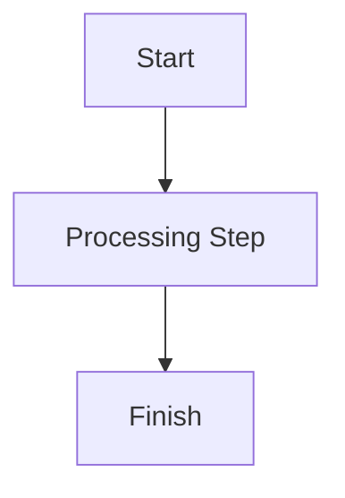

# RFC: [Feature/Proposal Name]

## 1. Summary
<!--
Briefly describe the background, purpose, and key problems solved by this proposal. Limit to 2-3 sentences.
-->

## 2. Status
<!--
Current status of the proposal and dates.
Examples:
- **Proposed** — YYYY-MM-DD
- **Approved** — YYYY-MM-DD
- **Rejected** — YYYY-MM-DD
-->
- **Current Status**: Proposed
- **Proposal Date**: YYYY-MM-DD
- **Last Updated**: YYYY-MM-DD

## 3. Motivation
<!--
Deeply explain why this change is needed:
- What are the pain points of the current system?
- What value does this proposal bring?
- What is the background context and user requirement?
-->

---

## 4. Detailed Design
<!--
Technical implementation details, which can include:
- System architecture diagram (Mermaid flowcharts are recommended)
- List of modified/new files and logical updates
- Code snippets, prompt designs, or API definitions
- Interaction flows and data structures between modules
-->

### 4.1 Architecture & Workflow

### 4.2 File & Module Changes
- **[NEW]** `path/to/new_file` — Describe the responsibility of the new file.
- **[MODIFY]** `path/to/existing_file` — Describe the modifications and updated logic.

---

## 5. Drawbacks & Risks
<!--
Potential negative impacts, risks, or limitations of this change:
- Will token consumption increase?
- Will it introduce runtime latency?
- Impact on compatibility (Breaking Changes).
-->

---

## 6. Alternatives Considered
<!--
Other alternatives evaluated and why they were rejected. Please list pros and cons for comparison.
-->
- **Option A: [Option Name]**
  - *Description*: ...
  - *Rationale for Rejection*: ...
- **Option B: [Option Name]**
  - *Description*: ...
  - *Rationale for Rejection*: ...

# ADR: [Decision Title]
<!--
(Optional) If this RFC involves a major architectural decision, attach the Architecture Decision Record here.
-->

## Context
<!--
Describe the technical context, constraints, and environmental factors necessitating the decision.
-->

## Decision Drivers
<!--
Key factors influencing the decision (e.g., performance, development speed, security, maintenance cost).
- Driver 1
- Driver 2
-->

## Decisions Made
<!--
What concrete technical choice was made? What is the core rationale?
-->

## Consequences
<!--
Consequences of this decision:
- **Positive**: ...
- **Negative**: ...
-->
