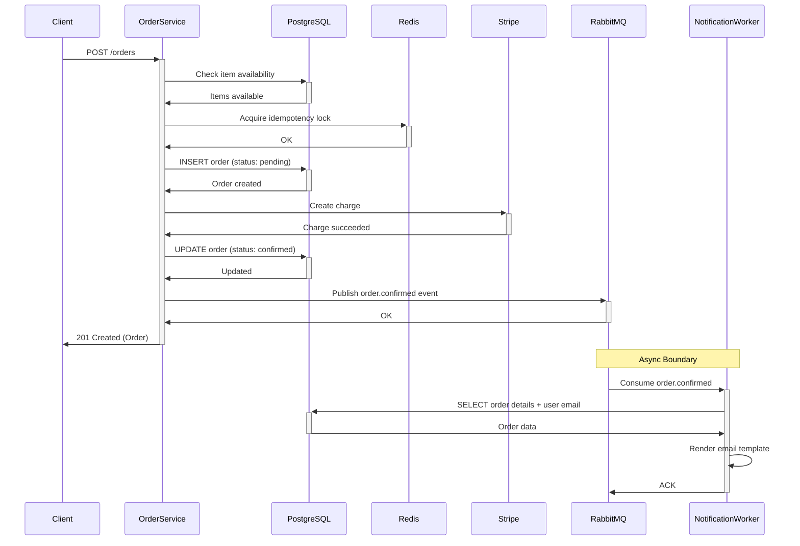

# Example Output: Place Order Flow

This is an example of the flow-tracer skill's output format, using a fictional e-commerce
"Place Order" flow.

---

# Place Order — E-Commerce Checkout Flow

## Overview

The Place Order endpoint creates a new order from a user's shopping cart, validates item
availability, charges the user's payment method via Stripe, and dispatches an async
notification to send a confirmation email. It returns the created order with a `pending`
status that transitions to `confirmed` once payment succeeds.

## Sequence Diagram



## Data Model

### Request/Response Schemas

```
Request: POST /orders
{
  user_id: string
  items: [
    { product_id: string, quantity: int, unit_price: decimal }
  ]
  payment_method_id: string
  shipping_address_id: string
}

Response: 201 Created
{
  order_id: string
  status: "pending" | "confirmed" | "failed"
  items: [
    { product_id: string, quantity: int, unit_price: decimal, subtotal: decimal }
  ]
  total_amount: decimal
  created_at: timestamp
}
```

### Database Tables

| Table | Operations | Key Columns |
|-------|-----------|-------------|
| `products` | SELECT | `id`, `name`, `stock_quantity`, `price` |
| `orders` | INSERT, UPDATE | `id`, `user_id`, `status`, `total_amount`, `created_at` |
| `order_items` | INSERT | `id`, `order_id`, `product_id`, `quantity`, `unit_price` |
| `users` | SELECT | `id`, `email`, `name` |

### Cache/Store Keys

| Key Pattern | Type | Purpose | TTL |
|------------|------|---------|-----|
| `order-idem-<userID>-<cartHash>` | String | Idempotency lock — prevents duplicate orders from the same cart | 30s |
| `stock-<productID>` | String | Cached stock count to reduce DB reads | 60s |

### Message Queue Payloads

| Queue | Event/Task Name | Payload | Consumer |
|-------|----------------|---------|----------|
| `order-events` | `order.confirmed` | `{"orderId": "<id>", "userId": "<uid>", "totalAmount": 49.99}` | `NotificationWorker` |
| `order-events-dlq` | — | Same as above | Manual review |

## Abstract Flow Steps

### Sync Phase — API Request

1. **Validate request and check item availability**
   → [`validateAndCheckStock`](file:///path/to/order_handler.go#L45)
   - Validates required fields (user_id, items, payment_method_id)
   - Queries `products` table to verify stock ≥ requested quantity for each item
   - On failure: returns `409 Conflict` with item-level stock errors

2. **Acquire idempotency lock**
   → [`acquireIdempotencyLock`](file:///path/to/order_service.go#L78)
   - Redis `SET order-idem-<userID>-<cartHash> NX EX 30`
   - On failure: returns `429 Too Many Requests` (duplicate order in progress)

3. **Create order record**
   → [`createOrder`](file:///path/to/order_service.go#L95)
   - Inserts into `orders` table with status `pending`
   - Inserts into `order_items` for each line item
   - Wrapped in a database transaction

4. **Charge payment method**
   → [`chargePayment`](file:///path/to/payment_service.go#L30)
   - Calls `stripe.charges.Create` with idempotency key `order-<orderID>`
   - Amount in smallest currency unit (cents)
   - On failure: updates order status to `failed`, returns `402 Payment Required`

5. **Confirm order and dispatch notification**
   → [`confirmAndNotify`](file:///path/to/order_service.go#L120)
   - Updates order status to `confirmed`
   - Publishes `order.confirmed` event to RabbitMQ `order-events` queue

### Async Phase — Notification Worker

6. **Send confirmation email**
   → [`handleOrderConfirmed`](file:///path/to/notification_worker.go#L22)
   - Queries order details and user email from database
   - Renders HTML email template with order summary
   - Sends via email service (SendGrid)
   - On failure: retries 3x with 30s delay, then moves to `order-events-dlq`

## Error Handling

| Error | Code/Status | Trigger | Behavior |
|-------|-------------|---------|----------|
| Missing required fields | `400 Bad Request` | Invalid request payload | Returns validation errors |
| Item out of stock | `409 Conflict` | Stock < requested quantity | Returns per-item availability |
| Duplicate order | `429 Too Many Requests` | Idempotency lock held | Returns existing order ID |
| Payment declined | `402 Payment Required` | Stripe charge fails | Order marked `failed`, lock released |
| Stripe rate limit | `503 Service Unavailable` | Stripe `rate_limit` error | Retries 3x with exponential backoff |
| Notification failure | — | Email send fails | Worker retries 3x, then dead-letter queue |

## Related Flows

- **Triggers**: `NotificationWorker.handleOrderConfirmed` (confirmation email)
- **Triggered by**: Shopping cart checkout flow (client-side)
- **Related**: `CancelOrder` flow reverses the charge and restores stock
