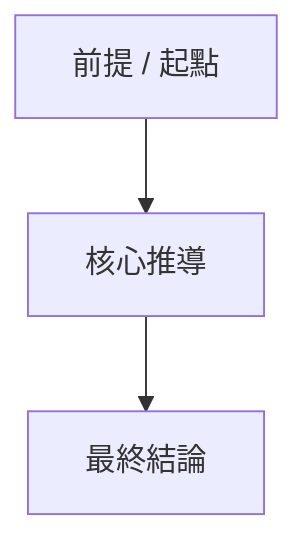

# {title}

## 來源
- **來源類型**: {Newsletter | Threads | YouTube | Website}
- **作者 / 寄件者**: {author}       ← optional; omit if not applicable
- **原文連結**: {url}
- **處理時間**: {timestamp}
- **任務 ID**: {task_id}            ← optional; omit for Newsletter

## 🔖 來源 Metadata
{Each skill fills source-specific metadata here.}
- YouTube: Whisper Model, video duration
- Newsletter: sender email address, subject line
- Threads: engagement metrics (likes, replies, reposts)
- Website: Domain/Host, original URL, scraped date (YYYY-MM-DD)

## 📝 TL;DR
- [3-5 句話精準概括：主題背景 + 核心問題 + 主要結論]

## 🎯 Core Thesis
> 一句話核心結論：[作者試圖讓讀者接受的單一核心主張]

支撐論點：
- [支撐論點 1]
- [支撐論點 2]
- [支撐論點 3（若有）]

## 🗺️ Reasoning Map
<!-- 依文章類型自適應選擇以下 3 種模板之一： -->

<!-- 模板 1：Linear Chain（適用於研究報告、論述型文章） -->
1. [作者的第一個前提 / 推論起點]
   - [具體數據或案例證據，若為純邏輯推論則省略此行]
2. [作者的第二個論證步驟 / 核心推導]
   - [支撐此步驟的關鍵證據]
3. [最終結論 / 推導結果]

<!-- 模板 2：Parallel Arguments（適用於觀點評論、多角度文章） -->
**Core Thesis**: [核心主張]
- **支撐角度 A**: [第一個切入角度]
  - [關鍵引言、案例或數據證據，若為純邏輯推論則省略此行]
- **支撐角度 B**: [第二個切入角度]
  - [支撐此角度的關鍵證據]
- **支撐角度 C**: [第三個切入角度]
  - [支撐此角度的關鍵證據]

<!-- 模板 3：Minimal（適用於新聞報導、資訊整理型、低訊號文章） -->
*(無複雜推導鏈，以下為事實資訊列舉)*
- [事實重點 1]
- [事實重點 2]
- [事實重點 3]

## ⭐ Reading Decision
- **推薦指數**: {★★★★★ | ★★★★☆ | ★★★☆☆ | ★★☆☆☆ | ★☆☆☆☆} ({語言對應標籤})
- **判斷依據**:
  - [依據 1：錨定 data/goals.md 之相關性與價值]
  - [依據 2：內容深度 / 創新度 / 實用性]
- **💡 真正的新資訊**:
  - [最具有價值的全新觀念，或寫「主要重新整理已知觀念」]

<!-- 星級評判標準（標籤隨設定語言切換）： -->
<!-- ★★★★★：突破性新框架 / 新做法，直接對應當前核心目標，必讀 -->
<!-- ★★★★☆：具高價值新資訊且與目標高度相關，值得全文細讀 -->
<!-- ★★★☆☆：良好背景知識，無突破性新意，閱讀 TL;DR / 摘要即可 -->
<!-- ★★☆☆☆：邊緣相關或已知觀念重述，可快速跳過 -->
<!-- ★☆☆☆☆：無實質新資訊、標題黨或重複內容，建議直接忽略 -->

## 🗺️ Visual Map
<!-- 條件式生成：僅當推薦指數為 ★★★★☆ 或 ★★★★★ 時產出 Mermaid 流程圖 -->
<!-- 若推薦指數為 ★☆☆☆☆ ~ ★★★☆☆，請填寫： -->
<!-- *(閱讀決定評級低於 ★★★★☆，省略視覺化圖表)* -->

## 🤖 AI Analysis

### 個人相關性（Personal Relevance）
- [讀取 data/goals.md，這與目前的工作有何交集？是否解決了目前的痛點？揭示了新機會？]

### 可行動性（Actionability）
- [現在可以做什麼？有什麼本週可以測試的實驗？必須具體且有時間限制，嚴禁寫「研究看看」。]

### 靈感觸發（Idea Generation）
- [這讓我想到什麼？這可以與什麼結合？哪些產業還沒開始用？觸發了什麼新專案想法？]

### 反思與預測（Reflection & Prediction）
- [二階效應是什麼？誰獲益，誰受損？什麼變得更有價值，什麼被淘汰？]

## ⚠️ 資訊免責聲明（Disclaimers）
- [若資訊完整清晰，此項可省略]

---

## 📄 原始內容（Raw Content）
- YouTube: verbatim yt2doc transcript, including TOC and all chapters
- Threads: verbatim extracted post content from fetch-threads-post
- Newsletter: Do NOT include this section. Due to HTML-heavy formatting and plain-text truncation, omit the raw content entirely.
- Website: Do NOT include this section. Web pages can be massive; omit the raw Jina Markdown to keep reports lightweight for daily distillation.
