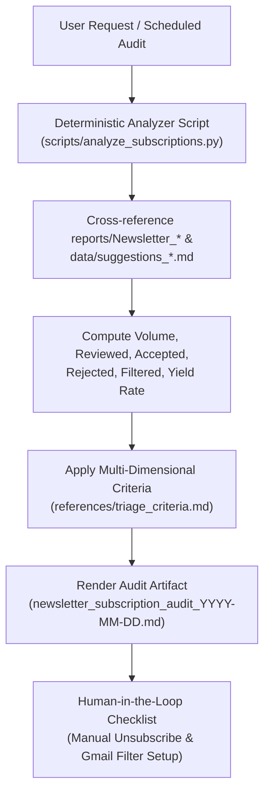

# 📬 `review-newsletter-subscriptions` Skill

> Autonomous health audit and ROI evaluator for technical newsletter subscriptions, synthesizing 30-day ingestion reports with historical suggestion reviews to recommend Keep, Unsubscribe, or Filter actions.

---

## 📖 Overview

As an AI engineer and knowledge worker, newsletters accumulate rapidly. While some newsletters deliver breakthrough prompt patterns, agent architectures, and career insights, others generate overwhelming noise—including paywalled teasers, theoretical system design quizzes, pure course marketing, and academic papers that contradict current operational focus.

`review-newsletter-subscriptions` provides a data-backed, deterministic mechanism to audit all received newsletter subscriptions over the past 30 days (or a custom time window). It calculates exact conversion telemetry (Acceptance Rate, Yield Rate, Hard-Veto frequency) and presents actionable recommendations in a dedicated review artifact.

---

## 🏗️ Architecture & Workflow

The skill follows a **Hybrid Architecture** combining deterministic Python telemetry with LLM qualitative synthesis:



---

## 🏛️ Architecture Decision Records (ADRs)

| ADR | Title | Decision Summary | Status | Key Rationale |
| :--- | :--- | :--- | :--- | :--- |
| **[ADR-0001](#adr-0001-hybrid-architecture-deterministic-python-script--llm-synthesis)** | Hybrid Architecture | Dedicated Python script for data crunching; LLM for qualitative reasoning | Accepted | Prevents LLM mental arithmetic hallucinations across 200+ report files and 650+ suggestions. |
| **[ADR-0002](#adr-0002-multi-dimensional-triage-criteria)** | Multi-Dimensional Criteria | Evaluate Acceptance Rate, Yield Rate, Hard-Veto frequency, and Paywall ratio | Accepted | Prevents naive single-metric sorting; distinguishes between high-noise and high-value sources. |
| **[ADR-0003](#adr-0003-human-in-the-loop-for-irreversible-subscription-actions)** | Human-in-the-Loop Boundary | Agent outputs search queries; user executes external unsubscribing/filtering | Accepted | Unsubscribing is an irreversible external action often requiring auth; avoids destructive automation. |
| **[ADR-0004](#adr-0004-decoupled-scheduling-via-runtime-environment)** | Decoupled Scheduling | Skill remains pure On-Demand; monthly cadence handled via Antigravity scheduler | Accepted | Preserves modularity and single responsibility; avoids pipeline coupling. |

---

### ADR-0001: Hybrid Architecture (Deterministic Python Script + LLM Synthesis)

* **Status**: Accepted
* **Date**: 2026-09-08
* **Deciders**: User & Antigravity Agent

#### Context
While user design preferences emphasize *Zero-Script Agent Skill Design* to minimize maintenance debt, newsletter subscription auditing requires scanning 200+ daily report files and cross-referencing 650+ suggestion entries across three markdown files (`suggestions_reviewed.md`, `suggestions_filtered.md`, `suggestions_pending.md`). Relying on pure LLM in-context inspection risks arithmetic hallucinations, calculation drift, and massive context token consumption.

#### Decision
Adopt a **Hybrid Architecture**: bundle a lightweight, deterministic Python script (`scripts/analyze_subscriptions.py`) inside the skill to parse files and calculate exact metrics, while reserving qualitative interpretation, contextual evaluation, and narrative synthesis to the LLM.

#### Consequences
* **Positive**: 100% calculation accuracy (<1s execution time); zero token waste on raw counting; testable via automated unit tests.
* **Negative**: Requires maintaining a Python script and associated unit test.

---

### ADR-0002: Multi-Dimensional Triage Criteria

* **Status**: Accepted
* **Date**: 2026-09-08
* **Deciders**: User & Antigravity Agent

#### Context
Classifying newsletters purely by review count or raw acceptance rate introduces false positives and false negatives:
- Low-volume newsletters (e.g. 朱騏 with 4 reports) have 100% acceptance and high value.
- High-volume newsletters (e.g. Hugging Face with 22 reports) have few reviews because 80% are automatically blocked by the Hard-Veto rule against academic papers.
- Newsletters like Gary Chen have low reviewed counts because content is locked behind Patreon paywalls.

#### Decision
Adopt a **4-dimensional evaluation framework** documented in `references/triage_criteria.md`:
1. **Acceptance Rate** ($A / R$)
2. **Overall Yield Rate** ($A / N$)
3. **Hard-Veto Rate** ($F / (R + F)$)
4. **Paywall / Teaser Ratio**

#### Consequences
* **Positive**: Accurately isolates different failure modes (academic mismatch, paywall barriers, interview trivia, volume fatigue).
* **Negative**: Slightly more complex rule tree than a single percentage cutoff.

---

### ADR-0003: Human-in-the-Loop for Irreversible Subscription Actions

* **Status**: Accepted
* **Date**: 2026-09-08
* **Deciders**: User & Antigravity Agent

#### Context
Once an audit recommends unsubscribing from a newsletter or setting a Gmail filter, the agent could theoretically attempt to automate this via browser or Gmail API. However, unsubscribing typically requires clicking external web links, solving CAPTCHAs, or confirming account credentials.

#### Decision
Strictly enforce a **Human-in-the-Loop boundary**: the agent delivers rich decision intelligence, exact Gmail search queries (e.g. `from:bytebytego.com`), and filter specifications. The user retains complete authority and executes unsubscriptions manually.

#### Consequences
* **Positive**: Completely eliminates risk of accidental unsubscriptions or unwanted Gmail filter side-effects; respects user authority.
* **Negative**: User must spend 1-2 minutes manually clicking unsubscribe links.

---

### ADR-0004: Decoupled Scheduling via Runtime Environment

* **Status**: Accepted
* **Date**: 2026-09-08
* **Deciders**: User & Antigravity Agent

#### Context
Subscription reviews are inherently periodic (e.g. monthly). We evaluated whether to hardcode monthly trigger logic into `daily-workflow` or keep the skill independent.

#### Decision
Keep `review-newsletter-subscriptions` as a **pure On-Demand skill**. Recurring execution is decoupled to Antigravity's runtime scheduler (`/schedule`), allowing the user to schedule monthly runs without modifying pipeline code.

#### Consequences
* **Positive**: Zero coupling to daily automation; skill remains clean, testable, and reusable.
* **Negative**: User sets up the schedule via `/schedule` rather than automatic built-in invocation.

---

## 📂 File Structure

```
review-newsletter-subscriptions/
├── README.md                          # Documentation & Architecture Decision Records (this file)
├── SKILL.md                           # Lean Spine (<120 lines): workflow, triage summary, artifact steps
├── scripts/
│   └── analyze_subscriptions.py       # Deterministic telemetry parser and metrics calculator
├── references/
│   ├── triage_criteria.md             # Detailed quantitative & qualitative decision heuristics
│   └── review_template.md             # Standardized Markdown audit artifact template
└── evals/
    └── evals.json                     # Automated evaluation test cases
```

---

## 🧪 Verification & Quality Gates

1. **Skill Validation**:
   ```bash
   python3 scripts/validate_skill.py .agents/skills/review-newsletter-subscriptions/SKILL.md
   ```
2. **Deterministic Script Execution**:
   ```bash
   python3 .agents/skills/review-newsletter-subscriptions/scripts/analyze_subscriptions.py --days 30
   ```
3. **Automated Unit Tests**:
   ```bash
   python3 -m unittest tests/test_newsletter_subscription_reviewer.py
   ```

---

## 📜 Changelog

| Version | Date | Changes |
|---|---|---|
| **v1.0.0** | 2026-09-08 | Initial release of `review-newsletter-subscriptions` skill with Hybrid Architecture, 4-dimensional triage heuristics, Human-in-the-Loop execution boundary, and ADRs 0001–0004. |
