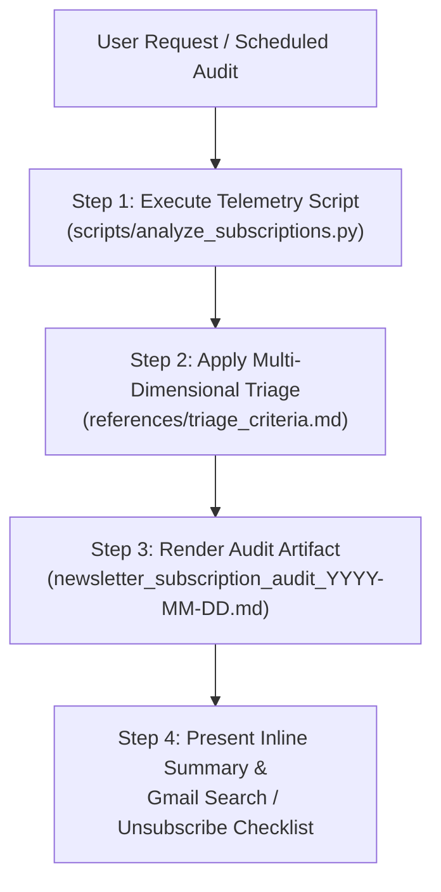

# review-newsletter-subscriptions

Audit and triage newsletter subscriptions by cross-referencing ingestion reports with user suggestion review history over the past 30 days (or a custom date range).

---

## Workflow Overview



---

## Step 1 — Run Telemetry Script

Execute the bundled analysis script to obtain deterministic statistics across reports and suggestion files:

```bash
python3 .agents/skills/review-newsletter-subscriptions/scripts/analyze_subscriptions.py --days 30 --json
```

*(Note: If the user specified a custom window like 60 days or explicit dates, pass `--days N` or `--start-date YYYY-MM-DD --end-date YYYY-MM-DD`.)*

The script outputs structured JSON containing:
- `reports_count`: Total reports received per source in `reports/Newsletter_*`
- `reviewed_count`: Suggestions reviewed by user in `data/suggestions_reviewed.md`
- `accepted_count` / `rejected_count`: Feedback breakdown
- `filtered_count`: Suggestions blocked in `data/suggestions_filtered.md` with veto categories
- `acceptance_rate` ($A / R$) and `yield_rate` ($A / N$)
- Initial `triage` tag (`Keep`, `Unsubscribe`, `Adjust`, `Watch`)

---

## Step 2 — Qualitative Triage & Contextual Analysis

Consult `references/triage_criteria.md` to evaluate each newsletter source against quantitative thresholds and qualitative project alignments:

1. **🟢 Keep (繼續訂閱)**:
   - Acceptance Rate $\ge 60\%$ or Yield $\ge 20\%$.
   - Has produced high-value project skills, prompt templates, or architecture improvements.
2. **🔴 Unsubscribe (建議取消訂閱)**:
   - Acceptance Rate $< 40\%$ (with $\ge 3$ reviews), OR
   - High Hard-Veto ratio (e.g. Paper reading, Claude Code/Cursor), OR
   - High paywalled teaser / course sales marketing ratio, OR
   - High volume ($N \ge 10$) with negligible yield ($< 8\%$).
3. **🟡 Adjust / Filter (設定 Gmail 篩選器)**:
   - High volume ($N \ge 15$), positive core value ($A \ge 2$), but contains separable noise (e.g. weekend specials, robotics).
   - Formulate targeted Gmail filter query (e.g. `from:sender "Sunday Special"`).
4. **⚪ Watch (持續觀察)**:
   - Low volume ($N < 5$, $R < 2$) without strong negative signals, or suggestions currently in `data/suggestions_pending.md`.

---

## Step 3 — Generate Audit Artifact

Create a dedicated Markdown Artifact using `references/review_template.md`:
- Target Path: `<appDataDir>/brain/<conversation-id>/newsletter_subscription_audit_YYYY-MM-DD.md`
- Title: `# 📬 Newsletter Subscription Audit (YYYY-MM-DD ~ YYYY-MM-DD)`
- Contents:
  1. Telemetry Table (Markdown table from `analyze_subscriptions.py`)
  2. 🟢 **Keep**: Highlight top articles, accepted suggestions, and workflow impact.
  3. 🔴 **Unsubscribe**: Detail why they failed (cite rejection comments and veto rules) + exact Gmail search queries.
  4. 🟡 **Adjust & Filter**: Specific Gmail filter rules to eliminate noise while preserving core signal.
  5. ⚪ **Watch**: Pending or low-sample notes.
  6. ✅ **Action Checklist**: Checkboxes with copyable Gmail search queries for manual execution.

---

## Step 4 — Deliver Inline Summary in Chat

After rendering the artifact, present a concise executive summary directly in the chat conversation:
- Point the user to the generated audit artifact.
- Highlight the Top 3 to Keep and Top 3 to Unsubscribe with core rationale.
- Reiterate that destructive actions (unsubscribing or setting Gmail filters) remain strictly under human control, referencing the checklist in the artifact.
