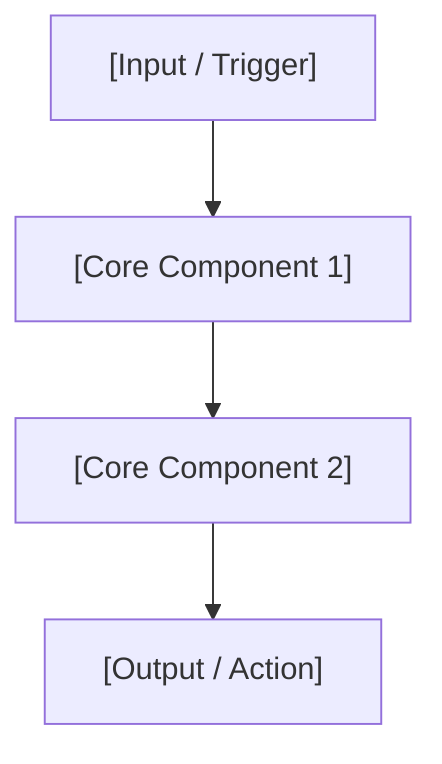

# tech-deconstructor Skill

A specialized Antigravity skill that deconstructs research papers, technical proposals, RFCs, system architectures, or engineering concepts into a structured 4-part analytical breakdown.

## Overview

`tech-deconstructor` transforms complex technical innovations—such as AI papers, system architecture proposals, and engineering post-mortems—into a rigorous, decision-focused breakdown. Inspired by deep technical analysis frameworks (e.g., CodeNib), it goes beyond superficial summaries to surface core engineering tradeoffs, candidate options considered and rejected, chosen architectural patterns, and quantifiable empirical outcomes.

## Problem Statement

Standard AI summaries often suffer from high-level generalizations:
- They explain **what** a system does, but ignore **why** specific design choices were made over alternative implementations.
- They omit **tradeoffs**, failing to capture the core friction points (e.g., Latency vs. Accuracy, Memory vs. Throughput).
- They gloss over **rejected candidate options**, losing valuable engineering context on why simpler or baseline approaches failed.
- They lack **empirical verification**, omitting quantifiable benchmark deltas, throughput figures, or token efficiency metrics.

## Solution

The `tech-deconstructor` skill enforces a mandatory 4-part analytical structure that systematically captures the entire decision path of a technical innovation.

```
[1. Problem & Pain Points] ──> [2. Candidate Options & Tradeoffs]
                                           │
[4. Empirical Results & Impact] <── [3. Chosen Architecture & Rationale]
```

### The 4-Part Analytical Framework

| Section | Key Analytical Focus |
|---|---|
| **1. 🎯 Problem & Motivation** | Core technical bottlenecks, failure modes of existing approaches, and fundamental tradeoffs (e.g., Memory vs. Speed, Accuracy vs. Token cost). |
| **2. ⚖️ Candidate Options & Tradeoffs** | 2–4 alternative candidate solutions evaluated during discovery, complete with pros, cons, and explicit rejection reasons. |
| **3. 🏗️ Chosen Architecture & Rationale** | Detailed breakdown of the selected architecture, key technical components, data flows (with Mermaid diagrams), and rationale for selection. |
| **4. 📊 Empirical Results & Impact** | Quantifiable metrics, benchmark performance deltas, resource savings, and real-world outcomes. |

---

## Output Template Structure

When executed, `tech-deconstructor` produces a report following this structure:

```markdown
# 🔬 Technical Deconstruction: [Title / Subject]

## 1. 🎯 想解決的問題 (Problem & Motivation)
[Detailed explanation of the core technical bottleneck or inefficiency.]

- **核心痛點 (Core Pain Points)**:
  - 1. **[Pain Point 1]**: [Detail]
  - 2. **[Pain Point 2]**: [Detail]
- **基本拉鋸 (Fundamental Tradeoffs)**: [e.g., Latency vs. Accuracy, Context Window vs. Cost]

---

## 2. ⚖️ 候選解決方案與權衡 (Candidate Options & Tradeoffs)

| 候選方案 (Option) | 優點 (Pros) | 缺點 / 評估結論 (Cons & Status) |
|---|---|---|
| **方案 A: [Option A Name]** | [Pros] | ❌ **[Rejected Reason]** |
| **方案 B: [Option B Name]** | [Pros] | ❌ **[Rejected Reason]** |
| **方案 C: [Option C Name]** | [Pros] | ✅ **[Selected Solution]** |

---

## 3. 🏗️ 最終選擇的架構與理由 (Chosen Architecture & Rationale)

### 核心組件與工作流程 (Core Components & Workflow)


- **1. [Component 1 Name]**: [Explanation of how it works and why it solves Pain Point 1]
- **2. [Component 2 Name]**: [Explanation of how it works and why it solves Pain Point 2]
- **3. [Component 3 Name]**: [Explanation of how it works]

---

## 4. 📊 實測效果與數據 (Empirical Results & Impact)

- **[Metric 1]**: [Quantifiable outcome, e.g. +25% Pass Rate]
- **[Metric 2]**: [Resource saving, e.g. -60% Token Consumption]
- **[Metric 3]**: [Error reduction, e.g. -50% Type/Syntax Errors]
```

---

## Triggering & Usage

Trigger this skill naturally in chat whenever you want a deep-dive analysis of a technical concept, research paper, RFC, or architecture document.

### Example Trigger Phrases

- `"Deconstruct this paper: https://arxiv.org/abs/..."`
- `"Analyze this technical concept like CodeNib: [Architecture / RFC / Concept]"`
- `"Deep dive into [paper/RFC/architecture]"`
- `"Break down this technical proposal"`
- `"Give me a 4-part technical deconstruction of [System / Paper]"`

---

## File Structure

```
tech-deconstructor/
├── SKILL.md   # Skill definition, framework schema, and execution rules
└── README.md  # Documentation and skill overview (this file)
```

---

## Quality Guidelines

1. **Be Specific, Not Generic**: Avoid hand-waving explanations. Include concrete technical terms, algorithms, data structures, and protocol names.
2. **Explicit Rejection Reasons**: Section 2 must clearly state *why* alternative options were rejected.
3. **Quantitative Metrics**: Section 4 must feature empirical numbers, benchmark deltas, or resource savings whenever data is available.

---

## Changelog

| Version | Date | Change Summary |
|---|---|---|
| v1.0.0 | 2026-07-30 | Initial release of `tech-deconstructor` skill with 4-part analytical framework and output template. |
