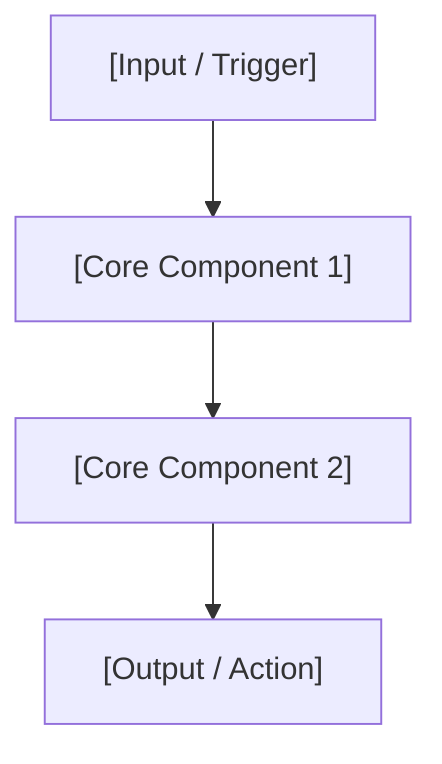

# tech-deconstructor

Systematically deconstructs complex technical innovations (research papers, RFCs, system architectures, software designs) into a rigorous 4-part analytical breakdown.

---

## 4-Part Analytical Framework

Every technical deconstruction MUST follow this exact structure:

```
[1. Problem & Pain Points] ──> [2. Candidate Options & Tradeoffs]
                                           │
[4. Empirical Results & Impact] <── [3. Chosen Architecture & Rationale]
```

| Section | Key Analytical Focus |
|---|---|
| **1. Problem & Motivation** | Core bottlenecks, failure modes of existing approaches, and fundamental tradeoffs (e.g. Memory vs. Speed, Accuracy vs. Token cost). |
| **2. Candidate Options & Tradeoffs** | 2–4 alternative candidate solutions evaluated during discovery. Include pros, cons, and explicit reasons for rejection. |
| **3. Chosen Architecture & Rationale** | Detailed breakdown of the selected solution, key technical components, data flows, and WHY it was chosen over alternative candidates. |
| **4. Empirical Results & Outcomes** | Quantifiable metrics, benchmark performance, resource savings, and real-world impact. |

---

## Execution Steps

### Step 1 — Gather Source Materials
- Read the target paper, article, codebase, or technical description.
- Identify the core innovation, baseline approaches, candidate alternatives, and reported metrics.

### Step 2 — Structure the Analysis
Write the deconstruction following the exact template below.

---

## Output Template

```markdown
# 🔬 Technical Deconstruction: [Title / Subject]

## 1. 🎯 想解決的問題 (Problem & Motivation)
[Detailed explanation of the core technical bottleneck or inefficiency.]

- **核心痛點 (Core Pain Points)**:
  - 1. **[Pain Point 1]**: [Detail]
  - 2. **[Pain Point 2]**: [Detail]
- **基本拉鋸 (Fundamental Tradeoffs)**: [e.g., Latency vs. Accuracy, Context Window vs. Cost]

---

## 2. ⚖️ 候選解決方案與權衡 (Candidate Options & Tradeoffs)

```
[Candidate A] ──> [Rejection Reason / Bottleneck]
[Candidate B] ──> [Rejection Reason / Bottleneck]
[Candidate C] ──> [Chosen Solution]
```

| 候選方案 (Option) | 優點 (Pros) | 缺點 / 評估結論 (Cons & Status) |
|---|---|---|
| **方案 A: [Option A Name]** | [Pros] | ❌ **[Rejected Reason]** |
| **方案 B: [Option B Name]** | [Pros] | ❌ **[Rejected Reason]** |
| **方案 C: [Option C Name]** | [Pros] | ✅ **[Selected Solution]** |

---

## 3. 🏗️ 最終選擇的架構與理由 (Chosen Architecture & Rationale)

[High-level overview of why Option C was selected as the optimal architecture.]

### 核心組件與工作流程 (Core Components & Workflow)


- **1. [Component 1 Name]**: [Explanation of how it works and why it solves Pain Point 1]
- **2. [Component 2 Name]**: [Explanation of how it works and why it solves Pain Point 2]
- **3. [Component 3 Name]**: [Explanation of how it works]

---

## 4. 📊 實測效果與數據 (Empirical Results & Impact)

- **[Metric 1]**: [Quantifiable outcome, e.g. +25% Pass Rate]
- **[Metric 2]**: [Resource saving, e.g. -60% Token Consumption]
- **[Metric 3]**: [Error reduction, e.g. -50% Type/Syntax Errors]

---
```

---

## Guidelines

1. **Be Specific, Not Generic**: Avoid hand-waving explanations. Include concrete technical terms, algorithms, data structures, and protocol names.
2. **Explicit Rejection Reasons**: Section 2 must clearly state *why* alternative options were rejected.
3. **Quantitative Metrics**: Section 4 must feature empirical numbers, benchmark deltas, or resource savings whenever data is available.
